# Design Document

## Overview

This design implements focused CI/CD pipeline improvements for the Gold Digger project using simple, maintainable GitHub Actions workflows. The enhancement replaces complex custom scripts with well-maintained marketplace actions and separates concerns into focused, independent workflows that are easy to troubleshoot and maintain.

The design prioritizes simplicity and reliability by using proven GitHub Actions from the marketplace, standard cargo commands that developers can run locally, and cargo-dist for complete release automation. Each workflow has a single responsibility and can be debugged independently without complex custom logic.

## Architecture

### Current State Analysis

The project currently has basic CI workflows that need focused improvements:

**Existing Infrastructure:**

- Basic workflow files that need simplification and separation of concerns
- Limited cross-platform testing coverage
- Missing quality gates and security scanning
- No coverage reporting or release automation

**Enhancement Strategy:**

The design implements separate, focused workflows using well-maintained GitHub Actions:

1. **Cross-Platform Testing**: Independent workflows testing both latest and older supported versions (ubuntu-latest + ubuntu-22.04, windows-latest + windows-2022, macos-latest + macos-13)
2. **Quality Gates**: Dedicated workflow using standard cargo commands and marketplace actions
3. **Security Scanning**: Focused security workflow using GitHub's CodeQL action and cargo audit
4. **Coverage Reporting**: Simple coverage workflow using proven marketplace actions
5. **Release Automation**: Complete cargo-dist integration for automated releases
6. **Workflow Organization**: Single-responsibility workflows that are easy to understand and debug

### Platform Compatibility Strategy

**Platform Testing Strategy**:

The CI pipeline tests against both the latest and older supported versions to ensure broad compatibility:

- **Ubuntu**: `ubuntu-latest` (currently ubuntu-24.04) and `ubuntu-22.04`
- **Windows**: `windows-latest` (currently windows-2025) and `windows-2022`
- **macOS**: `macos-latest` (currently macos-14) and `macos-13`

**Coverage Rationale**:

This approach provides comprehensive coverage by testing:

- **Latest versions**: Using `-latest` labels ensures we test against current platform versions
- **Older supported versions**: Testing specific older versions (22.04, 2022, 13) ensures compatibility with users on slightly older but still supported systems
- **Version span**: Covers approximately 3 years of platform versions, providing good backward compatibility
- **Future-proof**: `-latest` labels automatically update to newer versions as GitHub Actions updates them

**GitHub Actions Runner Labels Used**:

- `ubuntu-latest`, `ubuntu-22.04`
- `windows-latest`, `windows-2022`
- `macos-latest`, `macos-13`

**Design Rationale**: Using current platform versions ensures access to the latest tooling, security updates, and performance improvements while maintaining broad compatibility. The three-version compatibility window provides sufficient coverage for most deployment environments without requiring maintenance of legacy systems.

### Pipeline Architecture

```mermaid
graph TD
    A[Push/PR Trigger] --> B[Quality Gates Workflow]
    A --> C[Ubuntu Testing Workflows]
    A --> D[macOS Testing Workflows]
    A --> E[Windows Testing Workflows]
    A --> F[Security Scanning Workflow]
    A --> G[Coverage Reporting Workflow]

    H[Tag Push] --> I[cargo-dist Release Workflow]
    I --> J[Automated SBOM Generation]
    I --> K[Artifact Signing & Attestation]
    I --> L[GitHub Release Publication]

    subgraph "Independent Workflows"
        B --> B1[cargo fmt --check]
        B --> B2[cargo clippy]
        C --> C1[cargo test on ubuntu-latest]
        C --> C2[cargo test on ubuntu-22.04]
        D --> D1[cargo test on macos-latest]
        D --> D2[cargo test on macos-13]
        E --> E1[cargo test on windows-latest]
        E --> E2[cargo test on windows-2022]
        F --> F1[CodeQL Analysis]
        F --> F2[cargo audit]
        G --> G1[Coverage Generation]
        G --> G2[Codecov Upload]
    end

    subgraph "cargo-dist Automation"
        I --> I1[Cross-platform Builds]
        I --> I2[Checksum Generation]
        I --> I3[Release Notes]
    end
```



## Components and Interfaces

### 1. Quality Gates Workflow

**Purpose**: Enforce code quality standards using standard cargo commands and marketplace actions

**Key Components**:

- **Rust Toolchain Setup**: `dtolnay/rust-toolchain@stable` action for reliable toolchain management
- **Caching**: `swatinem/rust-cache@v2` for automatic Rust-specific caching
- **Format Checking**: `cargo fmt --check` with clear error messages
- **Linting**: `cargo clippy -- -D warnings` with zero-tolerance policy
- **Local Reproducibility**: Standard cargo commands that developers can run locally

**Workflow Structure**:

```yaml
name: Quality Gates
on:
  push: {branches: [main]}
  pull_request: {branches: [main]}

jobs:
  quality:
    runs-on: ubuntu-latest
    steps:
      - uses: actions/checkout@v4
      - uses: dtolnay/rust-toolchain@stable
      - uses: swatinem/rust-cache@v2
      - name: Check formatting
        run: cargo fmt --check
      - name: Run clippy
        run: cargo clippy -- -D warnings
```

**Design Rationale**: Uses proven marketplace actions for reliability and focuses on standard cargo commands that developers can reproduce locally. Runs on `ubuntu-latest` since code quality checks are platform-independent. Single responsibility makes troubleshooting straightforward.

### 2. Cross-Platform Testing Workflows

**Purpose**: Independent testing workflows for each supported platform

**Key Components**:

- **Platform-Specific Workflows**: Separate workflows for each platform testing both latest and older versions
- **Standard Actions**: `dtolnay/rust-toolchain@stable` and `swatinem/rust-cache@v2` for consistency
- **Standard Commands**: `cargo test` or `cargo nextest run` for test execution
- **Isolated Failures**: Platform-specific failures are easy to identify and debug
- **Parallel Execution**: All platforms run independently for faster feedback

**Workflow Structure**:

```yaml
# Example: Ubuntu Latest Testing Workflow
name: Test Ubuntu Latest
on:
  push: {branches: [main]}
  pull_request: {branches: [main]}

jobs:
  test-ubuntu-latest:
    runs-on: ubuntu-latest
    steps:
      - uses: actions/checkout@v4
      - uses: dtolnay/rust-toolchain@stable
      - uses: swatinem/rust-cache@v2
      - name: Run tests
        run: cargo test

# Example: Ubuntu 22.04 Testing Workflow  
name: Test Ubuntu 22.04
on:
  push: {branches: [main]}
  pull_request: {branches: [main]}

jobs:
  test-ubuntu-22:
    runs-on: ubuntu-22.04
    steps:
      - uses: actions/checkout@v4
      - uses: dtolnay/rust-toolchain@stable
      - uses: swatinem/rust-cache@v2
      - name: Run tests
        run: cargo test
```

**Design Rationale**: Separate workflows make platform-specific issues easy to identify and debug. Using standard marketplace actions ensures reliability and predictable behavior across all platforms.

### 3. Security Scanning Workflow

**Purpose**: Simple security analysis using standard GitHub Actions

**Key Components**:

- **CodeQL Analysis**: Standard GitHub CodeQL action for Rust security analysis
- **Dependency Auditing**: `cargo audit` with standard GitHub Actions
- **Clear Error Messages**: Actionable error messages for vulnerability remediation
- **GitHub Security Integration**: Results visible in GitHub Security tab
- **Simple Troubleshooting**: Standard actions make debugging predictable

**Workflow Structure**:

```yaml
name: Security
on:
  push: {branches: [main]}
  pull_request: {branches: [main]}

jobs:
  codeql:
    runs-on: ubuntu-latest
    steps:
      - uses: actions/checkout@v4
      - uses: github/codeql-action/init@v3
        with:
          languages: rust
      - uses: github/codeql-action/autobuild@v3
      - uses: github/codeql-action/analyze@v3

  audit:
    runs-on: ubuntu-latest
    steps:
      - uses: actions/checkout@v4
      - uses: dtolnay/rust-toolchain@stable
      - name: Security audit
        run: cargo audit
```

**Design Rationale**: Uses standard GitHub Actions for security scanning to ensure reliability and integration with GitHub's security features. Runs on `ubuntu-latest` since security scanning is platform-independent. Simple structure makes troubleshooting straightforward.

### 4. Coverage Reporting Workflow

**Purpose**: Simple test coverage reporting using well-maintained actions

**Key Components**:

- **Standard Toolchain**: `dtolnay/rust-toolchain` for consistent Rust setup
- **Coverage Tools**: `taiki-e/install-action@v2` for installing coverage tools (with `cargo-bins/cargo-binstall` fallback)
- **Standard Commands**: `cargo test` or coverage commands that developers can run locally
- **Codecov Integration**: `codecov/codecov-action` for coverage upload
- **Simple Troubleshooting**: Standard actions and commands for easy debugging

**Workflow Structure**:

```yaml
name: Coverage
on:
  push: {branches: [main]}
  pull_request: {branches: [main]}

jobs:
  coverage:
    runs-on: ubuntu-latest
    steps:
      - uses: actions/checkout@v4
      - uses: dtolnay/rust-toolchain@stable
      - uses: taiki-e/install-action@v2
        with:
          tool: cargo-llvm-cov
      - name: Generate coverage
        run: cargo llvm-cov --lcov --output-path lcov.info
      - uses: codecov/codecov-action@v4
        with:
          file: lcov.info
```

**Design Rationale**: Uses proven marketplace actions for coverage generation and upload. Standard commands ensure developers can reproduce coverage locally for debugging.

### 5. cargo-dist Release Automation

**Purpose**: Complete release automation using cargo-dist standard tooling

**Key Components**:

- **Automatic Workflow Generation**: cargo-dist generates the release workflow automatically
- **Cross-Platform Builds**: Auditable artifacts for all configured platforms
- **SBOM Generation**: Automatic SBOM generation using cargo-auditable
- **Artifact Signing**: Automatic attestation and signing
- **Checksum Generation**: SHA256 checksums as part of standard process
- **Configuration-Driven**: All changes made through cargo-dist.toml
- **Changelog Integration**: Works with git-cliff for automated changelog generation

**Implementation Strategy**:

```toml
# cargo-dist.toml configuration
[workspace]
members = ["dist"]

[dist]
cargo-dist-version = "0.8.0"
ci = ["github"]
installers = ["shell", "powershell", "homebrew", "msi"]
targets = [
  "x86_64-unknown-linux-gnu",
  "aarch64-apple-darwin",
  "x86_64-apple-darwin",
  "x86_64-pc-windows-msvc",
]
pr-run-mode = "plan"

[dist.github-actions]
attestations = true
```

**Design Rationale**: Leverages cargo-dist's proven release automation to handle all aspects of release management. Configuration-driven approach ensures consistency and reduces custom scripting.

### 6. git-cliff Changelog Automation

**Purpose**: Automated changelog generation using git-cliff for conventional commits

**Key Components**:

- **git-cliff Integration**: Automated changelog generation from conventional commit messages
- **Conventional Commit Parsing**: Support for commit types, scopes, and breaking changes
- **Release Integration**: Automatic changelog updates during release workflow
- **Chronological Ordering**: Proper versioning and chronological entry organization
- **Standard Tooling**: Use git-cliff as a proven changelog generation tool

**Implementation Strategy**:

```yaml
# git-cliff changelog generation in release workflow
  - name: Generate Changelog
    uses: taiki-e/install-action@v2
    with:
      tool: git-cliff
  - name: Update Changelog
    run: |
      git-cliff --tag ${{ github.ref_name }} --output CHANGELOG.md
      git-cliff --tag ${{ github.ref_name }} --strip header --output release-notes.md
```

**Design Rationale**: Uses git-cliff for structured changelog generation from conventional commits. Provides consistent, categorized changelog entries while maintaining simplicity and standard tooling approach.

### 7. Workflow Organization and Cleanup

**Purpose**: Simple, focused workflow organization for easy maintenance

**Cleanup Strategy**:

- **Single Responsibility**: Each workflow focuses on one specific area
- **Independent Workflows**: Quality, testing (per platform), security, coverage, release
- **Standard Actions**: Use proven marketplace actions throughout
- **Simple Structure**: Easy to understand and troubleshoot independently

**Final Workflow Structure**:

```yaml
.github/workflows/
├── quality.yml        # Code formatting and linting
├── test-ubuntu-latest.yml    # Ubuntu latest testing
├── test-ubuntu-22.yml        # Ubuntu 22.04 testing
├── test-macos-latest.yml     # macOS latest testing
├── test-macos-13.yml         # macOS 13 testing
├── test-windows-latest.yml   # Windows latest testing
├── test-windows-2022.yml     # Windows 2022 testing
├── security.yml       # CodeQL and cargo audit
├── coverage.yml       # Test coverage reporting
└── release.yml        # cargo-dist generated (do not edit)
```

**Design Rationale**: Separate workflows make issues easy to identify and debug. Each workflow can be understood and maintained independently without complex interdependencies.

## Data Models

### Workflow Configuration Schema

```yaml
# Simple workflow structure using standard actions
quality_workflow:
  name: Quality Gates
  triggers:
    - push: {branches: [main]}
    - pull_request: {branches: [main]}
  jobs:
    quality:
      runs-on: ubuntu-latest
      steps:
        - uses: actions/checkout@v4
        - uses: dtolnay/rust-toolchain@stable
        - uses: swatinem/rust-cache@v2
        - run: cargo fmt --check
        - run: cargo clippy -- -D warnings

platform_test_workflow:
  name: Test {Platform}
  triggers:
    - push: {branches: [main]}
    - pull_request: {branches: [main]}
  jobs:
    test:
      runs-on: {platform-runner: null}
      steps:
        - uses: actions/checkout@v4
        - uses: dtolnay/rust-toolchain@stable
        - uses: swatinem/rust-cache@v2
        - run: cargo test
```

### cargo-dist Configuration Schema

```toml
# cargo-dist.toml - complete release automation
[workspace]
members = ["dist"]

[dist]
cargo-dist-version = "0.8.0"
ci = ["github"]
installers = ["shell", "powershell", "homebrew", "msi"]
targets = [
  "x86_64-unknown-linux-gnu",
  "aarch64-apple-darwin",
  "x86_64-apple-darwin",
  "x86_64-pc-windows-msvc",
]
pr-run-mode = "plan"

[dist.github-actions]
attestations = true
```

### Security Configuration Schema

```yaml
# Simple security workflow using standard actions
security_workflow:
  name: Security
  jobs:
    codeql:
      steps:
        - uses: actions/checkout@v4
        - uses: github/codeql-action/init@v3
        - uses: github/codeql-action/autobuild@v3
        - uses: github/codeql-action/analyze@v3

    audit:
      steps:
        - uses: actions/checkout@v4
        - uses: dtolnay/rust-toolchain@stable
        - run: cargo audit
```

### Quality Standards Schema

```yaml
quality_standards:
  formatting:
    command: cargo fmt --check
    standard: rustfmt configuration
    tolerance: zero_violations
    local_reproduction: cargo fmt --check

  linting:
    command: cargo clippy -- -D warnings
    policy: zero_tolerance
    local_reproduction: cargo clippy -- -D warnings

  testing:
    command: cargo test
    platforms: [ubuntu-latest, ubuntu-22.04, macos-latest, macos-13, 
          windows-latest, windows-2022]
    local_reproduction: cargo test

  security:
    codeql:
      tool: github/codeql-action
      integration: github_security_tab

    dependency_audit:
      tool: cargo audit
      local_reproduction: cargo audit

  coverage:
    tool: cargo-llvm-cov
    upload: codecov/codecov-action
    local_reproduction: cargo llvm-cov --lcov
```

### Marketplace Actions Schema

```yaml
standard_actions:
  rust_toolchain:
    action: dtolnay/rust-toolchain@stable
    purpose: reliable_rust_setup

  caching:
    action: swatinem/rust-cache@v2
    purpose: automatic_rust_caching

  tool_installation:
    primary: taiki-e/install-action@v2
    fallback: cargo-bins/cargo-binstall
    purpose: cargo_tool_installation

  codecov_upload:
    action: codecov/codecov-action@v4
    purpose: coverage_reporting

  codeql_security:
    action: github/codeql-action/*@v3
    purpose: security_analysis
```

## Error Handling

### 1. Clear Error Reporting

**Format Violations**:

```bash
# Standard cargo fmt error output
Error: Code formatting violations detected
Command: cargo fmt --check
Files with issues: src/main.rs, src/lib.rs
Action: Run 'cargo fmt' to fix automatically
Local reproduction: cargo fmt --check
```

**Lint Warnings**:

```bash
# Standard clippy error output  
Error: Clippy warnings detected
Command: cargo clippy -- -D warnings
Policy: Zero tolerance for warnings
Action: Fix warnings or run 'cargo clippy --fix'
Local reproduction: cargo clippy -- -D warnings
```

**Platform-Specific Test Failures**:

```bash
# Clear platform attribution
Error: Tests failed on macos-13
Workflow: test-macos-13.yml
Command: cargo test
Status: ubuntu-latest ✅, ubuntu-22.04 ✅, macos-latest ✅, windows-latest ✅, windows-2022 ✅, macos-13 ❌
Action: Check platform-specific test failures
Local reproduction: cargo test
```

### 2. Security Scan Failures

**CodeQL Analysis**:

```bash
# Standard GitHub Security tab integration
Error: CodeQL analysis found security issues
Tool: github/codeql-action
Integration: Results visible in GitHub Security tab
Action: Review security findings in GitHub Security tab
Local reproduction: Not applicable (GitHub-hosted analysis)
```

**Dependency Audit Failures**:

```bash
# Standard cargo audit output
Error: Security advisory detected
Tool: cargo audit
Advisory: RUSTSEC-2023-XXXX affecting serde < 1.0.190
Severity: High
Action: Update Cargo.toml dependencies
Local reproduction: cargo audit
```

### 3. Coverage and Release Failures

**Coverage Generation Failures**:

```bash
# Standard coverage tool errors
Error: Coverage generation failed
Tool: cargo-llvm-cov
Command: cargo llvm-cov --lcov --output-path lcov.info
Action: Check test execution and coverage configuration
Local reproduction: cargo llvm-cov --lcov
```

**Release Automation Failures**:

```bash
# cargo-dist standard error output
Error: Release build failed
Tool: cargo-dist
Issue: Cross-platform build failure
Action: Check cargo-dist.toml configuration
Documentation: cargo-dist troubleshooting guide
```

## Testing Strategy

### 1. Workflow Validation

**Independent Workflow Testing**:

- Test each workflow independently (quality, platform testing, security, coverage)
- Validate standard GitHub Actions work correctly across all platforms
- Test platform-specific failure isolation and clear error reporting
- Verify marketplace actions provide consistent behavior

**Quality Gate Testing**:

- Test formatting enforcement with `cargo fmt --check`
- Test linting enforcement with `cargo clippy -- -D warnings`
- Validate that developers can reproduce failures locally
- Test clear error messages and actionable guidance

**Local Reproduction Testing**:

- Verify all CI commands can be run locally with same results
- Test standard cargo commands work consistently across platforms
- Validate troubleshooting steps are accurate and helpful
- Ensure no custom scripts are required for local development

### 2. Security and Release Testing

**Security Workflow Testing**:

- Test CodeQL analysis integration with GitHub Security tab
- Validate `cargo audit` dependency scanning
- Test clear security error reporting and remediation guidance
- Verify standard GitHub Actions security integration

**cargo-dist Release Testing**:

- Test cargo-dist configuration and workflow generation
- Validate cross-platform artifact generation
- Test automatic SBOM generation and attestation
- Verify release automation works without custom scripts

### 3. Coverage and Release Testing

**Coverage Workflow Testing**:

- Test coverage generation using `taiki-e/install-action` and `cargo-llvm-cov`
- Validate Codecov upload with `codecov/codecov-action`
- Test coverage report accuracy and local reproduction
- Verify simple troubleshooting when coverage fails

**cargo-dist Release Testing**:

- Test cargo-dist configuration and automatic workflow generation
- Validate cross-platform builds and artifact generation
- Test automatic SBOM generation and attestation via cargo-dist
- Verify GitHub release notes generation and publication

**Workflow Organization Testing**:

- Test independent workflow execution and failure isolation
- Validate simple workflow structure and troubleshooting
- Test documentation updates reflecting simple CI approach
- Verify marketplace actions work reliably across platforms

## Implementation Phases

### Phase 1: Quality Gates and Platform Testing

**Objective**: Implement simple, focused workflows using standard marketplace actions

**Requirements Addressed**: 1, 2, 6, 8, 10

**Tasks**:

1. Create quality gates workflow using `dtolnay/rust-toolchain@stable` and `swatinem/rust-cache@v2`
2. Implement separate platform testing workflows for ubuntu-latest + ubuntu-22.04, macos-latest + macos-13, windows-latest + windows-2022
3. Use standard `cargo fmt --check` and `cargo clippy -- -D warnings` commands
4. Ensure all commands can be reproduced locally by developers
5. Implement clear error reporting using standard GitHub Actions output

**Success Criteria**:

- Independent workflows for quality gates and each platform
- Standard marketplace actions used throughout
- Clear platform-specific failure attribution
- Developers can reproduce all CI commands locally
- Simple troubleshooting without custom scripts

### Phase 2: Security Scanning and Coverage

**Objective**: Add security scanning and coverage using proven marketplace actions

**Requirements Addressed**: 3, 4, 6, 8, 10

**Tasks**:

1. Create security workflow using standard `github/codeql-action` for CodeQL analysis
2. Add `cargo audit` dependency scanning with standard actions
3. Implement coverage workflow using `taiki-e/install-action` and `codecov/codecov-action`
4. Ensure security results integrate with GitHub Security tab
5. Use standard actions for all security and coverage operations

**Success Criteria**:

- CodeQL analysis integrated with GitHub Security tab using standard actions
- Dependency auditing with clear error messages and local reproduction
- Coverage reporting using proven marketplace actions
- All security and coverage operations use standard tooling
- Simple troubleshooting for all security and coverage workflows

### Phase 3: cargo-dist Release Automation

**Objective**: Complete release automation using cargo-dist standard tooling

**Requirements Addressed**: 5, 9, 10

**Tasks**:

1. Configure cargo-dist for complete release automation
2. Set up cargo-dist.toml for cross-platform builds and attestation
3. Enable automatic SBOM generation via cargo-dist (cargo-auditable)
4. Configure git-cliff for automated changelog generation from conventional commits
5. Let cargo-dist generate and manage the release workflow

**Success Criteria**:

- cargo-dist handles all release automation automatically
- Cross-platform builds with automatic SBOM generation and attestation
- Automated changelog generation using git-cliff and conventional commits
- Release workflow generated and managed by cargo-dist
- No custom release scripts or complex tooling required

### Phase 4: Workflow Organization and Documentation

**Objective**: Finalize simple, focused workflow organization

**Requirements Addressed**: 7, 8

**Tasks**:

1. Organize workflows into single-responsibility files
2. Remove any complex or deprecated workflows
3. Update documentation to reflect simple, standard approach
4. Document troubleshooting steps for each workflow
5. Ensure all workflows use proven marketplace actions

**Success Criteria**:

- Each workflow has single responsibility and is easy to understand
- Documentation reflects simple, standard CI approach
- Troubleshooting guides available for each workflow
- All workflows use well-maintained marketplace actions
- No custom scripts or complex logic in any workflow

**Success Criteria**:

- Each workflow has single responsibility and is easy to understand
- Documentation reflects simple, standard CI approach
- Troubleshooting guides available for each workflow
- All workflows use well-maintained marketplace actions
- No custom scripts or complex logic in any workflow

## Performance Considerations

### Simple Caching Strategy

**Automatic Rust Caching**:

- Use `swatinem/rust-cache@v2` for automatic Rust-specific caching
- Leverage default cache key optimization provided by the action
- No custom cache configuration required

**Standard Action Performance**:

- Marketplace actions are optimized for performance and reliability
- Standard actions handle caching and optimization automatically
- No custom performance tuning required

### Independent Workflow Execution

**Parallel Platform Testing**:

- Separate workflows for each platform run independently
- No complex matrix strategies or job dependencies
- Simple failure isolation and faster feedback

**Focused Workflow Scope**:

- Each workflow has single responsibility for faster execution
- No complex interdependencies between workflows
- Simple resource usage patterns

### Resource Optimization

**Standard Runner Usage**:

- Use standard GitHub-hosted runners for all workflows
- No custom runner configuration or optimization required
- Standard timeout and resource limits

## Security Considerations

### Simple Security Integration

**Standard GitHub Security**:

- Use GitHub's CodeQL action for security analysis
- Leverage GitHub Security tab for vulnerability reporting
- Standard integration with GitHub's security features

**Dependency Security**:

- Use `cargo audit` for dependency vulnerability scanning
- Standard cargo commands for security auditing
- Clear error messages for security remediation

### cargo-dist Security Automation

**Automatic Security Features**:

- cargo-dist handles SBOM generation automatically via cargo-auditable
- Automatic artifact signing and attestation
- Standard GitHub OIDC authentication

**Supply Chain Security**:

- cargo-dist provides SLSA provenance automatically
- Standard build environment isolation
- Automatic transparency and verification features

### Simple Security Practices

**Standard Actions Security**:

- Use well-maintained marketplace actions with good security track records
- Avoid custom scripts that could introduce security vulnerabilities
- Leverage GitHub's built-in security features and integrations

**Clear Security Reporting**:

- Security issues reported through standard GitHub Security tab
- Clear, actionable error messages for security failures
- Simple troubleshooting for security-related issues
