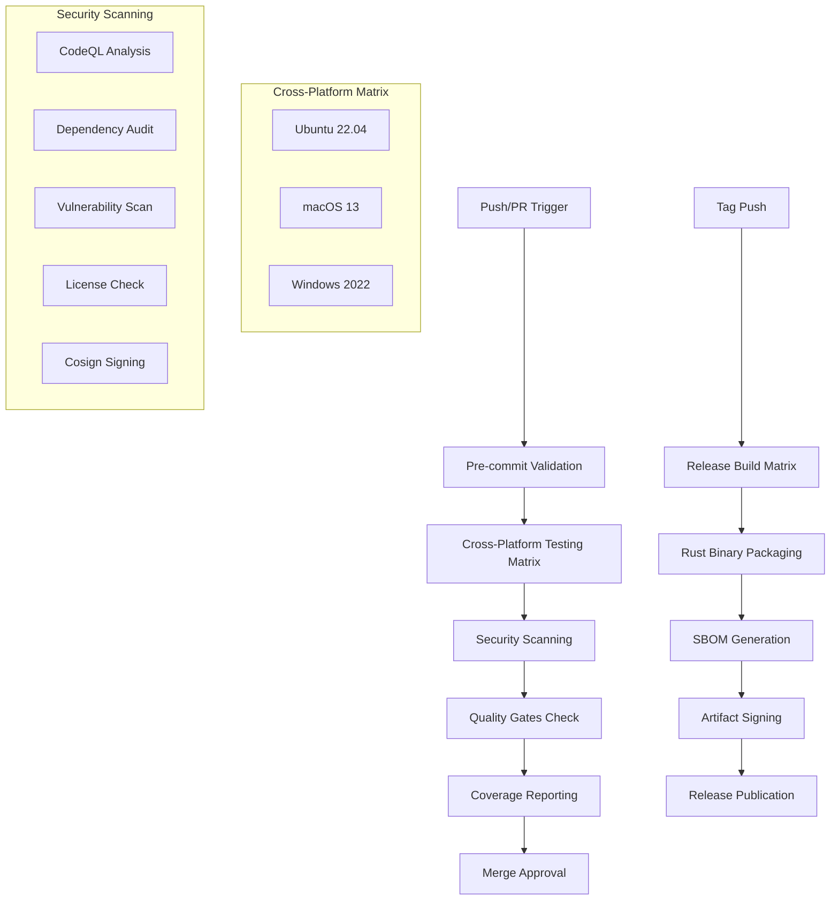

# Design Document

## Overview

This design implements a comprehensive CI/CD pipeline enhancement for the Gold Digger project to meet EvilBit Labs pipeline standards. The enhancement transforms the current basic CI workflows into a complete, secure, and standards-compliant CI/CD pipeline that addresses all identified gaps in cross-platform testing, quality gates, security scanning, and coverage reporting.

The design creates a unified pipeline architecture that consolidates workflow functionality while maintaining clear separation of concerns. It leverages the project's existing justfile commands to ensure consistency between local development and CI environments, and implements comprehensive security controls including SBOM generation, vulnerability scanning, and artifact signing.

## Architecture

### Current State Analysis

The project currently has basic CI workflows that need comprehensive enhancement:

**Existing Infrastructure:**

- Basic workflow files that require consolidation and optimization
- Limited cross-platform testing coverage
- Incomplete security scanning integration
- Missing comprehensive quality gates
- Inconsistent justfile integration

**Identified Gaps:**

- No standardized cross-platform testing matrix (Ubuntu 22.04, macOS 13, Windows 2022)
- Missing zero-tolerance quality gate enforcement
- Incomplete security scanning pipeline (CodeQL, SBOM generation, vulnerability scanning)
- No comprehensive coverage reporting with Codecov integration
- Missing secure release automation with proper artifact signing
- Inconsistent CI/local development command parity

### Enhancement Areas

The design addresses these critical areas:

1. **Cross-Platform Testing Matrix**: Implement comprehensive testing across Ubuntu 22.04, macOS 13, and Windows 2022
2. **Quality Gate Enforcement**: Establish zero-tolerance policies for formatting and linting violations
3. **Security Integration**: Implement complete security scanning with CodeQL, SBOM generation, and vulnerability detection
4. **Coverage Reporting**: Add comprehensive test coverage tracking and reporting
5. **Secure Release Automation**: Implement artifact signing, SBOM generation, and secure distribution
6. **Justfile Integration**: Ensure complete parity between CI and local development commands
7. **Workflow Cleanup**: Remove deprecated workflows and streamline CI infrastructure
8. **Error Handling**: Implement proper exit codes and actionable error reporting
9. **Changelog Automation**: Add automated changelog generation with conventional commits

### Pipeline Architecture



## Components and Interfaces

### 1. Cross-Platform CI Workflow

**Purpose**: Main CI pipeline implementing comprehensive cross-platform testing and quality gates

**Key Components**:

- **Cross-Platform Matrix**: Ubuntu 22.04, macOS 13, Windows 2022 testing
- **Quality Gate Enforcement**: Zero-tolerance formatting and linting with blocking behavior
- **OS-Aware Caching**: Platform-specific cache keys to prevent cross-contamination
- **Justfile Integration**: Use `just fmt-check`, `just lint`, `just test-nextest` for consistency
- **Proper Error Handling**: Actionable error messages with specific failure attribution

**Workflow Structure**:

```yaml
# Triggers
on:
  push: {branches: [main]}
  pull_request: {branches: [main]}
  workflow_dispatch: {}

# Jobs
jobs:
  pre-commit:
    # OS-aware caching with runner-specific keys
    # Validate pre-commit hooks without continue-on-error
  quality-gates:
    # just fmt-check (zero tolerance for formatting violations)
    # just lint (zero tolerance for clippy warnings)
    # Block progression on any failures
  cross-platform-tests:
    strategy:
      matrix:
        os: [ubuntu-22.04, macos-13, windows-2022]
    # just test-nextest execution
    # Platform-specific failure attribution
  coverage:
    # Ubuntu-only coverage generation
    # Codecov upload with proper token authentication
    # PR comment integration
```

**Design Rationale**: Separates concerns while maintaining comprehensive coverage. OS-aware caching prevents cross-platform cache pollution, and zero-tolerance quality gates ensure consistent code standards.

### 2. Secure Release Automation Workflow

**Purpose**: Comprehensive secure release pipeline with artifact signing and SBOM generation

**Key Components**:

- **Cross-Platform Builds**: Ubuntu 22.04, macOS 13, Windows 2022 artifact generation
- **Rust-Native Tooling**: `taiki-e/upload-rust-binary-action` for consistent packaging
- **Security Controls**: Cosign keyless OIDC signing, CycloneDX SBOM generation
- **GitHub OIDC**: Secure authentication without personal access tokens
- **Changelog Automation**: `git-cliff` integration for conventional commit-based releases

**Workflow Architecture**:

```yaml
# Release workflow structure
jobs:
  changelog-generation:
    # git-cliff for conventional commit parsing
    # Structured changelog with commit types and scopes
    # Chronological ordering and proper versioning
  cross-platform-build:
    strategy:
      matrix:
        os: [ubuntu-22.04, macos-13, windows-2022]
    # Rust-native binary packaging
    # SHA256 checksum generation
    # Platform-specific artifact creation
  security-attestation:
    # cargo-cyclonedx SBOM generation for all artifacts
    # Cosign keyless OIDC signing
    # Comprehensive security metadata
    # CI artifact upload for transparency
  release-publication:
    # GitHub release creation with all artifacts
    # SBOM and signature attachment
    # Automated changelog integration
```

**Design Rationale**: Prioritizes security and transparency while maintaining simplicity. Uses Rust-native tooling for better ecosystem integration and implements comprehensive attestation for supply chain security.

### 3. Comprehensive Security Scanning Workflow

**Purpose**: Unified security analysis with vulnerability detection and supply chain protection

**Key Components**:

- **CodeQL Analysis**: Rust-specific static analysis for security vulnerabilities
- **SBOM Generation**: `cargo-auditable` and `cargo-cyclonedx` via `cargo-dist` for complete dependency tracking
- **Vulnerability Scanning**: `grype` consuming CycloneDX SBOMs as primary input (`grype sbom:target/cyclonedx-bom.json`) with fallback to image/file/system scan mode, including failure handling and artifact retention
- **Dependency Auditing**: `cargo-audit` and `cargo-deny` for advisory checking
- **Artifact Management**: Security scan results uploaded as CI artifacts

**Workflow Structure**:

```yaml
# Security scanning workflow
jobs:
  codeql-analysis:
    # CodeQL initialization and Rust analysis
    # SARIF upload to GitHub Security tab
    # Integration with security reporting
  dependency-security:
    # cargo-auditable and cargo-cyclonedx SBOM generation via cargo-dist
    # grype vulnerability scanning consuming CycloneDX SBOMs (grype sbom:target/cyclonedx-bom.json)
    # fallback to grype image/file/system scan mode if CycloneDX unavailable with logging
    # cargo-audit advisory checking
    # cargo-deny license and security policy enforcement
  security-reporting:
    # Consolidate security scan results
    # Upload SBOM as CI artifact for transparency
    # Generate actionable security reports
    # Fail pipeline on security policy violations
```

**Design Rationale**: Consolidates all security scanning into a single workflow for better coordination and reporting. Implements strict failure policies for high-severity vulnerabilities while providing comprehensive visibility into the security posture.

### 4. Automated Changelog Generation

**Purpose**: Implement consistent, automated changelog generation using conventional commits

**Key Components**:

- **git-cliff Integration**: Automated changelog generation from conventional commit messages
- **Conventional Commit Parsing**: Support for commit types, scopes, and breaking changes
- **Release Integration**: Automatic changelog updates during release workflow
- **Chronological Ordering**: Proper versioning and chronological entry organization

**Implementation Strategy**:

```yaml
# Changelog generation workflow
changelog_generation:
  tool: git-cliff
  trigger: release_workflow
  format: conventional_commits

  commit_types:
    - feat: New features
    - fix: Bug fixes
    - docs: Documentation changes
    - style: Code style changes
    - refactor: Code refactoring
    - test: Test additions/modifications
    - chore: Maintenance tasks

  scopes:
    - cli: Command-line interface
    - db: Database operations
    - output: Output formatting
    - tls: TLS/SSL functionality
    - config: Configuration management
```

**Design Rationale**: Automates changelog maintenance to ensure consistent release documentation. Uses conventional commits to provide structured, categorized changelog entries that improve release transparency and user communication.

### 5. Justfile Integration Layer

**Purpose**: Ensure complete parity between CI operations and local development commands

**Core Integration Principles**:

- **Command Consistency**: All CI operations use justfile commands where available
- **Fallback Strategy**: Direct cargo commands when justfile recipes are unavailable
- **Development Parity**: CI results match local development execution
- **Environment Setup**: Consistent preparation across all environments

**Integrated Commands**:

```bash
# Quality Gates
just fmt-check     # Format validation (zero tolerance)
just lint          # Clippy with -D warnings (zero tolerance)
just test-nextest  # Test execution with nextest runner
just setup         # Development environment preparation

# Coverage and Reporting
just coverage-llvm # Coverage generation for CI upload
just ci-check      # Combined local CI validation

# Security Operations
just security      # Local security scanning
just audit         # Dependency auditing
```

**Fallback Implementation**:

```yaml
# Example CI step with justfile integration
  - name: Format Check
    run: |
      if command -v just >/dev/null 2>&1; then
        just fmt-check
      else
        cargo fmt --check
      fi
```

**Design Rationale**: Ensures developers can reproduce CI results locally and maintains consistency across all environments. Provides graceful fallback to direct cargo commands for environments without justfile support.

### 6. Workflow Cleanup and Consolidation

**Purpose**: Streamline CI infrastructure by removing deprecated workflows and consolidating functionality

**Cleanup Strategy**:

- **Remove rust.yml**: Functionality consolidated into main CI workflow
- **Remove rust-clippy.yml**: Clippy integration moved to quality gates workflow
- **Update release.yml**: Enhanced with security attestation and changelog automation
- **Consolidate Security**: Merge CodeQL and security scanning into unified workflow

**Consolidation Benefits**:

```yaml
# Before: Multiple separate workflows
.github/workflows/
├── rust.yml           # Basic Rust CI
├── rust-clippy.yml    # Separate clippy checks
├── codeql.yml         # Separate security analysis
├── security.yml       # Separate vulnerability scanning
└── release.yml        # Basic release automation

# After: Streamlined workflow structure
.github/workflows/
├── ci.yml             # Comprehensive CI with cross-platform testing
├── security.yml       # Unified security scanning and analysis
└── release.yml        # Enhanced secure release automation
```

**Documentation Updates**:

- Update README.md to reflect new CI capabilities and requirements
- Document new justfile integration and local development parity
- Add troubleshooting guides for common CI issues
- Update contribution guidelines with new quality gate requirements

**Design Rationale**: Reduces maintenance overhead while improving functionality. Consolidation eliminates duplicate workflows and provides better coordination between related CI operations.

## Data Models

### CI Configuration Schema

```yaml
# Cross-platform CI workflow structure
workflow:
  name: CI Pipeline
  triggers:
    - push: {branches: [main]}
    - pull_request: {branches: [main]}
    - workflow_dispatch: {}

  jobs:
    pre-commit:
      runs-on: ubuntu-22.04
      cache:
        key: ${{ runner.os }}-pre-commit-${{ 
          hashFiles('.pre-commit-config.yaml') }}
    quality-gates:
      runs-on: ubuntu-22.04
      steps:
        - just fmt-check  # Zero tolerance formatting
        - just lint       # Zero tolerance clippy warnings
    cross-platform-tests:
      strategy:
        matrix:
          os: [ubuntu-22.04, macos-13, windows-2022]
        fail-fast: false
      steps:
        - just test-nextest

    coverage:
      runs-on: ubuntu-22.04
      steps:
        - just coverage-llvm
        - codecov upload
```

### Release Configuration Schema

```yaml
# Secure release workflow structure
release_workflow:
  triggers:
    - push: {tags: [v*]}
  jobs:
    changelog:
      tool: git-cliff
      format: conventional_commits

    build_matrix:
      strategy:
        matrix:
          os: [ubuntu-22.04, macos-13, windows-2022]
      packaging: taiki-e/upload-rust-binary-action

    security_attestation:
      sbom_tool: cargo-cyclonedx
      signing: cosign-keyless-oidc
      authentication: github-oidc
```

### Security Artifact Schema

```json
{
  "sbom": {
    "format": "cyclonedx-json",
    "version": "1.5",
    "artifacts": [
      "binary",
      "dependencies"
    ]
  },
  "signatures": {
    "cosign": {
      "keyless": true,
      "oidc": true,
      "transparency_log": true
    }
  },
  "attestations": {
    "slsa_provenance": {
      "level": 3,
      "builder": "github-actions"
    }
  }
}
```

### Quality Gate Metrics

```yaml
quality_gates:
  formatting:
    command: just fmt-check
    fallback: cargo fmt --check
    tolerance: zero_violations
    blocking: true

  linting:
    command: just lint
    fallback: cargo clippy -- -D warnings
    tolerance: zero_warnings
    blocking: true

  testing:
    command: just test-nextest
    fallback: cargo test
    platforms: [ubuntu-22.04, macos-13, windows-2022]
    coverage_platform: ubuntu-22.04

  security:
    vulnerability_scan:
      tool: grype
      primary_input: sbom:target/cyclonedx-bom.json
      fallback_mode: image/file/system
      fallback_logging: required
      fail_on: [critical, high]
      blocking: true
      artifact_retention: true

    dependency_audit:
      tool: cargo-audit
      fail_on_advisory: true
      blocking: true

    sbom_generation:
      tool: cargo-dist (cargo-auditable + cargo-cyclonedx)
      format: cyclonedx-json
      upload_artifact: true

  coverage:
    tool: just coverage-llvm
    upload: codecov
    pr_comments: true
    platform: ubuntu-22.04
```

### Error Handling Schema

```yaml
error_handling:
  exit_codes:
    success: 0
    quality_gate_failure: 1
    security_failure: 2
    platform_failure: 3

  error_reporting:
    format: structured
    attribution: platform_specific
    actionability: required

  failure_modes:
    continue_on_error: false
    fail_fast: false  # For matrix builds
    blocking_behavior: true
```

## Error Handling

### 1. Quality Gate Failures

**Format Violations**:

```bash
# Zero-tolerance formatting enforcement
Error: Code formatting violations detected (Exit Code: 1)
Command: just fmt-check
Files: src/main.rs (lines 45-50), src/lib.rs (line 123)
Standard: 100-character line limit, rustfmt configuration
Action: Run 'just fmt' to fix automatically
Blocking: Merge blocked until resolved
```

**Lint Warnings**:

```bash
# Zero-tolerance clippy warning enforcement
Error: Clippy warnings detected (Exit Code: 1)
Command: just lint
Policy: Zero tolerance (-D warnings)
Warnings: 3 performance, 1 correctness
Action: Address warnings manually or run 'cargo clippy --fix'
Blocking: Merge blocked until all warnings resolved
```

**Pre-commit Hook Failures**:

```bash
# OS-aware pre-commit validation
Error: Pre-commit hook validation failed (Exit Code: 1)
Platform: ${{ runner.os }}
Cache: OS-specific cache key used
Failed Hooks: rust-fmt, rust-clippy
Action: Run 'pre-commit run --all-files' locally
Blocking: Pipeline progression blocked
```

### 2. Security Scan Failures

**Vulnerability Detection**:

```bash
# Grype vulnerability scanning consuming CycloneDX SBOMs with fallback
Error: Critical/High vulnerabilities detected (Exit Code: 2)
Tool: grype sbom:target/cyclonedx-bom.json
Policy: Fail on critical/high severity
Affected: openssl-sys 0.9.87 (CVE-2023-XXXX)
Severity: Critical
Remediation: Update to openssl-sys >= 0.9.90
SBOM Source: CycloneDX format from cargo-cyclonedx
Fallback: Would use grype image/file/system scan if SBOM unavailable
Artifact Retention: SBOM and scan results uploaded as CI artifacts
Blocking: Release and merge blocked
```

**Dependency Audit Failures**:

```bash
# cargo-audit security advisory detection
Error: Security advisory detected (Exit Code: 2)
Tool: cargo-audit
Advisory: RUSTSEC-2023-XXXX affecting serde < 1.0.190
Severity: High
Action: Update Cargo.toml dependencies
Link: https://rustsec.org/advisories/RUSTSEC-2023-XXXX
Blocking: Pipeline blocked until resolved
```

**SBOM Generation Failures**:

```bash
# cargo-auditable and cargo-cyclonedx SBOM generation via cargo-dist
Error: SBOM generation failed (Exit Code: 2)
Tool: cargo-dist (cargo-auditable + cargo-cyclonedx)
Format: CycloneDX JSON
Issue: Missing dependency metadata or cargo-dist configuration
Action: Check cargo-dist.toml configuration and dependency metadata
Artifact: SBOM upload failed - transparency compromised
```

### 3. Platform-Specific Failures

**Cross-Platform Test Failures**:

```bash
# Matrix strategy with platform attribution
Error: Tests failed on specific platform (Exit Code: 3)
Platform: macOS-13
Command: just test-nextest
Status: Ubuntu-22.04 ✅, Windows-2022 ✅, macOS-13 ❌
Attribution: Platform-specific issue detected
Isolation: Issue isolated to macOS environment
Action: Check platform-specific dependencies and configurations
Blocking: Merge blocked until all platforms pass
```

**Platform-Specific Build Issues**:

```bash
# Platform-specific compilation failures
Error: Platform build failed (Exit Code: 3)
Platform: Windows-2022
Command: cargo build --release
Issue: Platform-specific dependency resolution
Cause: Windows-specific TLS configuration
Action: Check platform-specific feature flags and dependencies
Matrix: Other platforms may still succeed (fail-fast: false)
```

**Coverage Generation Failures**:

```bash
# Ubuntu-specific coverage generation
Error: Coverage generation failed (Exit Code: 1)
Platform: Ubuntu-22.04 (coverage platform)
Command: just coverage-llvm
Issue: Coverage data collection failed
Impact: Codecov upload blocked, PR comments unavailable
Action: Check test execution and coverage tool configuration
```

## Testing Strategy

### 1. CI Pipeline Testing

**Cross-Platform Validation**:

- Test complete workflow execution on Ubuntu 22.04, macOS 13, Windows 2022
- Validate matrix strategy with fail-fast: false for complete platform coverage
- Test platform-specific failure attribution and error reporting
- Verify OS-aware caching with runner-specific cache keys

**Quality Gate Testing**:

- Test zero-tolerance formatting enforcement with `just fmt-check`
- Test zero-tolerance clippy warning enforcement with `just lint`
- Validate blocking behavior without continue-on-error
- Test pre-commit hook validation with OS-specific caching

**Justfile Integration Testing**:

- Test justfile command execution in CI environment (`just test-nextest`, `just setup`)
- Validate fallback to direct cargo commands when justfile unavailable
- Test command parity between CI and local development execution
- Verify consistent results across all supported platforms

### 2. Security Testing

**Comprehensive Security Scanning**:

- Test CodeQL analysis for Rust-specific security vulnerabilities
- Validate cargo-auditable and cargo-cyclonedx SBOM generation via cargo-dist
- Test grype vulnerability scanning consuming CycloneDX SBOMs (grype sbom:target/cyclonedx-bom.json)
- Validate grype fallback to image/file/system scan mode when CycloneDX unavailable
- Test fallback logging and proper failure handling with artifact retention
- Verify cargo-audit and cargo-deny integration for dependency security

**SBOM and Artifact Security**:

- Verify CycloneDX format SBOM completeness for all release artifacts
- Test SBOM upload as CI artifact for transparency
- Validate comprehensive dependency tracking accuracy
- Test integration between SBOM generation and vulnerability scanning

**Release Security Attestation**:

- Test Cosign keyless OIDC signing for all release artifacts
- Validate GitHub OIDC authentication without personal access tokens
- Test SHA256 checksum generation and verification
- Verify secure artifact distribution with proper attestation

### 3. Coverage and Release Testing

**Coverage Reporting Validation**:

- Test coverage generation on Ubuntu platform using `just coverage-llvm`
- Validate Codecov upload with proper token authentication
- Test coverage report visibility in pull request comments
- Verify coverage data accuracy and completeness

**Release Automation Testing**:

- Test cross-platform release builds (Ubuntu 22.04, macOS 13, Windows 2022)
- Validate Rust-native binary packaging with taiki-e/upload-rust-binary-action
- Test automated changelog generation with git-cliff and conventional commits
- Verify proper versioning, commit type parsing, and chronological ordering

**Workflow Cleanup Validation**:

- Test removal of deprecated workflow files (rust.yml, rust-clippy.yml)
- Validate streamlined CI infrastructure with only necessary workflows
- Test documentation updates reflecting new CI capabilities
- Verify no regression in functionality after cleanup

## Implementation Phases

### Phase 1: Cross-Platform CI Foundation

**Objective**: Implement comprehensive cross-platform testing matrix and quality gates

**Requirements Addressed**: 1, 2, 6, 8

**Tasks**:

1. Create cross-platform CI workflow with Ubuntu 22.04, macOS 13, Windows 2022 matrix
2. Implement zero-tolerance quality gates with `just fmt-check` and `just lint`
3. Add OS-aware caching with runner-specific cache keys
4. Integrate justfile commands with fallback to direct cargo commands
5. Implement proper error handling with actionable messages and exit codes

**Success Criteria**:

- All three platforms execute tests successfully with proper failure attribution
- Zero-tolerance policies block merges on formatting/linting violations
- OS-specific caching prevents cross-platform cache pollution
- CI commands match local development execution results
- Error messages provide specific, actionable guidance

### Phase 2: Security Integration and SBOM Generation

**Objective**: Implement comprehensive security scanning with vulnerability detection

**Requirements Addressed**: 3, 5

**Tasks**:

1. Integrate CodeQL analysis for Rust security vulnerabilities
2. Implement cargo-auditable and cargo-cyclonedx SBOM generation via cargo-dist for all components
3. Add grype vulnerability scanning consuming CycloneDX SBOMs (grype sbom:target/cyclonedx-bom.json) with fallback to image/file/system scan mode and proper logging
4. Configure cargo-audit and cargo-deny for dependency security
5. Upload SBOM as CI artifact for transparency

**Success Criteria**:

- CodeQL analysis integrated with GitHub Security tab
- CycloneDX SBOM generated via cargo-dist for all release artifacts at target/cyclonedx-bom.json
- Grype vulnerability scanning consumes CycloneDX SBOMs as primary input with fallback capability
- Vulnerability scanning blocks pipeline on critical/high severity issues
- Security scan results provide remediation guidance
- SBOM artifacts available for transparency and compliance

### Phase 3: Coverage Reporting and Release Automation

**Objective**: Add comprehensive coverage reporting and secure release automation

**Requirements Addressed**: 4, 5, 9

**Tasks**:

1. Implement coverage generation on Ubuntu using `just coverage-llvm`
2. Configure Codecov upload with proper token authentication
3. Add coverage visibility in pull request comments
4. Implement secure release automation with Cosign keyless OIDC signing
5. Integrate git-cliff for automated changelog generation
6. Add Rust-native binary packaging with taiki-e/upload-rust-binary-action

**Success Criteria**:

- Coverage reports generated and uploaded to Codecov successfully
- Coverage data visible in PR comments for review
- Release artifacts signed with Cosign keyless OIDC authentication
- Automated changelog generation from conventional commits
- Cross-platform release builds with proper security attestation

### Phase 4: Workflow Cleanup and Documentation

**Objective**: Streamline CI infrastructure and update documentation

**Requirements Addressed**: 7, 8

**Tasks**:

1. Remove deprecated workflow files (rust.yml, rust-clippy.yml)
2. Consolidate security workflows into unified pipeline
3. Update README.md with new CI capabilities and requirements
4. Add comprehensive troubleshooting documentation
5. Document justfile integration and local development parity

**Success Criteria**:

- Only necessary workflow files remain in .github/workflows
- Documentation accurately reflects new CI capabilities
- Troubleshooting guides available for common CI issues
- Contribution guidelines updated with new quality gate requirements
- No regression in functionality after cleanup

## Performance Considerations

### Caching Strategy

**Rust Compilation Cache**:

- Use `Swatinem/rust-cache@v2` for Cargo registry and build cache
- Implement cache key optimization for better hit rates
- Use separate cache keys for different feature combinations

**Pre-commit Cache**:

- Cache pre-commit environments across runs
- Use OS-specific cache keys for better performance
- Implement cache cleanup for storage optimization

### Parallel Execution

**Matrix Strategy Optimization**:

- Use `fail-fast: false` for complete platform coverage
- Implement job dependencies for optimal resource usage
- Use concurrency groups to prevent resource conflicts

**Security Scanning Parallelization**:

- Run CodeQL analysis in parallel with other security scans
- Optimize SBOM generation for faster execution
- Use artifact sharing between jobs for efficiency

### Resource Usage Optimization

**Runner Selection**:

- Use appropriate runner sizes for different job types
- Optimize Windows runner usage (most expensive)
- Implement job timeout limits for resource protection

**Artifact Management**:

- Optimize artifact size and retention policies
- Use compression for large artifacts
- Implement artifact cleanup for storage management

## Security Considerations

### Supply Chain Security

**SLSA Compliance**:

- Maintain SLSA Level 3 provenance for all releases
- Ensure build environment isolation and integrity
- Implement proper artifact signing and verification

**Dependency Management**:

- Regular dependency auditing with cargo-audit
- License compliance checking with cargo-deny
- Vulnerability scanning with Grype and fail-on policies

### Credential Management

**OIDC Authentication**:

- Use GitHub OIDC for release authentication (already implemented)
- Avoid personal access tokens where possible
- Implement proper secret management for third-party integrations

**Environment Security**:

- Ensure DATABASE_URL never appears in logs
- Implement credential redaction in verbose output
- Use secure environment variable handling

### Artifact Security

**Signing and Attestation**:

- Cosign keyless signing for all release artifacts
- SLSA provenance attestation for build integrity
- Transparency log integration for public verification

**SBOM Security**:

- Complete software bill of materials for all artifacts
- Vulnerability scanning of SBOM contents
- Regular SBOM updates with dependency changes
