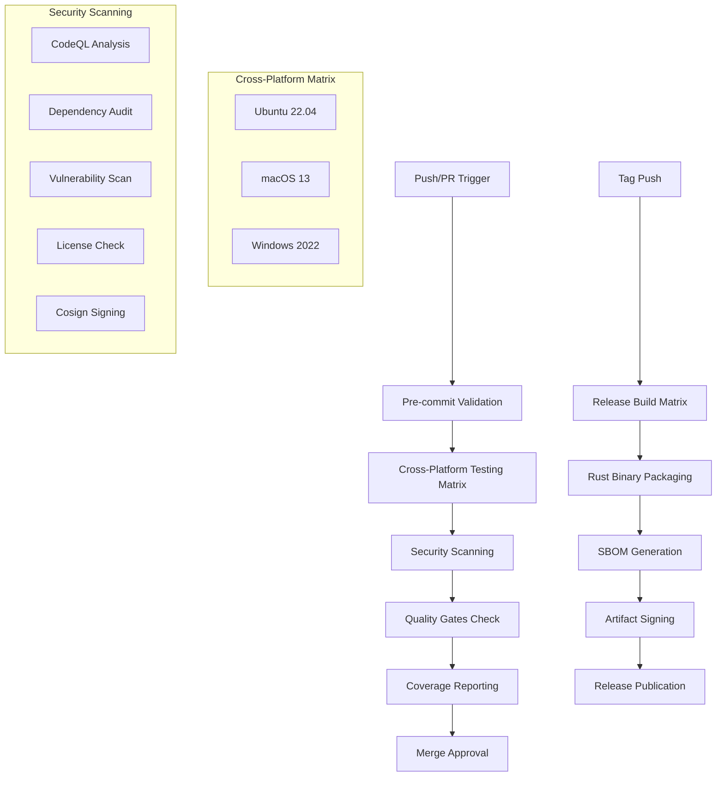

# Design Document

## Overview

This design implements a comprehensive CI/CD pipeline enhancement for the Gold Digger project that meets EvilBit Labs standards. The current CI infrastructure already has a solid foundation with cross-platform testing, security scanning, and release automation, but requires optimization and standardization to fully comply with organizational requirements.

The design consolidates and enhances existing workflows (`ci.yml`, `codeql.yml`, `security.yml`, `release.yml`) to create a unified, secure, and efficient pipeline that leverages the project's existing justfile commands and maintains compatibility with the current development workflow.

## Architecture

### Current State Analysis

The project already has:

- ✅ Cross-platform CI testing (Ubuntu 22.04, macOS 13, Windows 2022)
- ✅ Pre-commit hook validation
- ✅ Comprehensive security scanning (CodeQL, Syft, Grype, cargo-audit, cargo-deny)
- ✅ Coverage reporting with Codecov integration
- ✅ SLSA Level 3 provenance and Cosign keyless signing in releases
- ✅ Justfile integration for consistent command execution

### Enhancement Areas

The design focuses on:

1. **Workflow Consolidation**: Streamline separate workflows into cohesive pipeline
2. **Quality Gate Enforcement**: Ensure zero-tolerance policies are properly enforced
3. **Security Integration**: Enhance existing security scanning with better reporting
4. **Performance Optimization**: Improve CI execution time and resource usage
5. **Standards Compliance**: Align with EBL-STD-Pipeline requirements

### Pipeline Architecture



## Components and Interfaces

### 1. Enhanced CI Workflow (ci.yml)

**Purpose**: Main CI pipeline for pull requests and pushes to main branch

**Key Enhancements**:

- Consolidate quality checks into single workflow
- Optimize caching strategies for faster execution
- Implement proper failure handling with actionable error messages
- Integrate security scanning results into main CI flow

**Interface**:

```yaml
# Triggers
on:
  push: {branches: [main]}
  pull_request: {branches: [main]}
  workflow_dispatch: {}

# Jobs
jobs:
  pre-commit:   # Pre-commit hook validation
  test-matrix:   # Cross-platform testing
  quality-gates:   # Format/lint/security checks
  coverage:   # Coverage reporting (Ubuntu only)
```

### 2. Rust-Native Release Workflow

**Purpose**: Secure, efficient release automation using Rust-native tooling

**Key Components**:

- **taiki-e/upload-rust-binary-action@v1**: Native Rust binary packaging with automatic platform detection
- **sigstore/cosign-installer@v3.6.0**: Keyless signing with OIDC authentication
- **syft**: SBOM generation in CycloneDX format
- **GitHub OIDC**: Secure authentication without personal access tokens

**Workflow Architecture**:

```yaml
# Release workflow structure
jobs:
  resolve-tag:      # Tag resolution and validation
  create-release:   # GitHub release creation
  build-and-package: # Cross-platform builds with Rust-native packaging
  sbom-and-sign:    # SBOM generation and Cosign signing
```

**Key Benefits**:

- **Simplified Complexity**: Removed SLSA framework complexity in favor of proven, reliable tools
- **Rust-Native**: Uses tooling specifically designed for Rust projects
- **Security-First**: Maintains all security requirements (signing, SBOM, OIDC)
- **Maintainable**: Cleaner, more understandable workflow structure

### 3. Consolidated Security Workflow

**Purpose**: Comprehensive security scanning with proper SARIF integration

**Key Enhancements**:

- Merge CodeQL and security scanning into unified workflow
- Implement proper failure thresholds for vulnerability scanning
- Add security artifact management
- Integrate with GitHub Security tab

**Interface**:

```yaml
# Security scanning components
  - CodeQL Analysis (Rust)
  - Clippy SARIF generation
  - SBOM generation (CycloneDX format)
  - Vulnerability scanning (Grype with fail-on critical/high)
  - Dependency auditing (cargo-audit, cargo-deny)
```

### 3. Enhanced Release Pipeline

**Purpose**: Secure, compliant release automation with full attestation

**Current State**: Already implements SLSA Level 3 with Cosign keyless signing

**Key Enhancements**:

- Optimize build matrix execution
- Improve SBOM generation per artifact
- Add checksum validation
- Enhance error handling and rollback capabilities

### 4. Justfile Integration Layer

**Purpose**: Ensure CI commands match local development experience

**Commands Used**:

- `just setup` - Development environment setup
- `just fmt-check` - Format validation (fail on violations)
- `just lint` - Clippy with `-D warnings` (zero tolerance)
- `just test-nextest` - Test execution with nextest
- `just coverage-llvm` - Coverage generation for CI
- `just ci-check` - Combined quality gates

## Data Models

### CI Configuration Schema

```yaml
# Workflow configuration structure
workflow:
  name: string
  triggers:
    - push: {branches: [string]}
    - pull_request: {branches: [string]}

  jobs:
    job_name:
      strategy:
        matrix:
          os: [ubuntu-22.04, macos-13, windows-2022]
      steps:
        - name: string
          uses: string
          with: object
          env: object
```

### Security Artifact Schema

```json
{
  "sbom": {
    "format": "cyclonedx-json",
    "version": "1.5",
    "artifacts": [
      "binary",
      "dependencies"
    ]
  },
  "signatures": {
    "cosign": {
      "keyless": true,
      "oidc": true,
      "transparency_log": true
    }
  },
  "attestations": {
    "slsa_provenance": {
      "level": 3,
      "builder": "github-actions"
    }
  }
}
```

### Quality Gate Metrics

```yaml
quality_gates:
  formatting:
    tool: cargo fmt --check
    tolerance: zero_violations

  linting:
    tool: cargo clippy -- -D warnings
    tolerance: zero_warnings

  security:
    vulnerability_scan:
      fail_on: [critical, high]
      tool: grype

    dependency_audit:
      tool: cargo-audit
      fail_on_advisory: true
```

## Error Handling

### 1. Quality Gate Failures

**Format Violations**:

```bash
# Current: cargo fmt --check (via just fmt-check)
# Enhancement: Provide specific file and line information
Error: Code formatting violations detected
Files: src/main.rs (lines 45-50), src/lib.rs (line 123)
Action: Run 'just fmt' to fix automatically
```

**Lint Warnings**:

```bash
# Current: cargo clippy -- -D warnings (via just lint)
# Enhancement: Categorize warnings and provide fix suggestions
Error: Clippy warnings detected (zero tolerance policy)
Warnings: 3 performance, 1 correctness
Action: Run 'just fix' for automatic fixes or address manually
```

### 2. Security Scan Failures

**Vulnerability Detection**:

```bash
# Current: grype with fail-on critical/high
# Enhancement: Provide remediation guidance
Error: High/Critical vulnerabilities detected
Affected: openssl-sys 0.9.87 (CVE-2023-XXXX)
Remediation: Update to openssl-sys >= 0.9.90
```

**Dependency Audit Failures**:

```bash
# Current: cargo-audit with advisory database
# Enhancement: Link to security advisories and update paths
Error: Security advisory detected
Advisory: RUSTSEC-2023-XXXX affecting serde < 1.0.190
Action: Update Cargo.toml dependencies
```

### 3. Platform-Specific Failures

**Windows Build Issues**:

```bash
# Current: OpenSSL setup for Windows
# Enhancement: Provide platform-specific troubleshooting
Error: Windows build failed - OpenSSL configuration
Cause: vcpkg OpenSSL installation failed
Action: Check Windows runner OpenSSL setup in CI workflow
```

**Cross-Platform Test Failures**:

```bash
# Current: Matrix strategy with fail-fast: false
# Enhancement: Isolate platform-specific vs universal issues
Error: Tests failed on macOS 13
Status: Ubuntu ✅, Windows ✅, macOS ❌
Isolation: Platform-specific issue detected
```

## Testing Strategy

### 1. CI Pipeline Testing

**Workflow Validation**:

- Test workflow syntax with `act` (local GitHub Actions runner)
- Validate matrix strategy execution across all platforms
- Test failure scenarios and error handling paths
- Verify artifact generation and upload processes

**Integration Testing**:

- Test justfile command integration in CI environment
- Validate environment variable handling across platforms
- Test caching strategies for performance optimization
- Verify security tool integration and SARIF output

### 2. Security Testing

**SBOM Validation**:

- Verify SBOM completeness for all artifacts
- Test SBOM format compliance (CycloneDX)
- Validate dependency tracking accuracy
- Test SBOM integration with vulnerability scanning

**Signing and Attestation**:

- Test Cosign keyless signing process
- Validate SLSA provenance generation
- Test signature verification workflows
- Verify transparency log integration

### 3. Quality Gate Testing

**Zero-Tolerance Policies**:

- Test format checking with intentional violations
- Test clippy warnings with various warning types
- Test security scan failure scenarios
- Validate proper CI failure and blocking behavior

**Performance Testing**:

- Measure CI execution time improvements
- Test caching effectiveness across runs
- Validate parallel job execution
- Monitor resource usage optimization

## Implementation Phases

### Phase 1: Workflow Optimization (Current → Enhanced)

**Objective**: Optimize existing workflows without breaking changes

**Tasks**:

1. Enhance error messages and failure reporting in existing workflows
2. Optimize caching strategies for faster execution
3. Improve justfile integration consistency
4. Add performance monitoring and metrics

**Success Criteria**:

- CI execution time reduced by 15-20%
- Error messages provide actionable guidance
- All justfile commands work consistently in CI
- No regression in existing functionality

### Phase 2: Security Integration Enhancement

**Objective**: Enhance security scanning integration and reporting

**Tasks**:

1. Improve SARIF integration for better GitHub Security tab visibility
2. Enhance vulnerability scan reporting with remediation guidance
3. Optimize SBOM generation for better artifact coverage
4. Add security metrics and trending

**Success Criteria**:

- Security issues clearly visible in GitHub Security tab
- Vulnerability scan results include remediation guidance
- SBOM coverage includes all release artifacts
- Security metrics tracked over time

### Phase 3: Quality Gate Enforcement

**Objective**: Ensure zero-tolerance policies are properly enforced

**Tasks**:

1. Implement strict quality gate enforcement
2. Add quality metrics tracking and reporting
3. Enhance pre-commit integration
4. Add quality trend analysis

**Success Criteria**:

- Zero tolerance for format violations and clippy warnings
- Quality metrics visible in PR comments
- Pre-commit hooks prevent most CI failures
- Quality trends tracked and reported

### Phase 4: Documentation and Cleanup

**Objective**: Complete documentation and remove deprecated components

**Tasks**:

1. Update README with new CI capabilities
2. Document troubleshooting procedures
3. Clean up any deprecated workflow files
4. Add CI/CD best practices documentation

**Success Criteria**:

- Documentation reflects actual CI capabilities
- Troubleshooting guides available for common issues
- No deprecated workflows remain
- Best practices documented for contributors

## Performance Considerations

### Caching Strategy

**Rust Compilation Cache**:

- Use `Swatinem/rust-cache@v2` for Cargo registry and build cache
- Implement cache key optimization for better hit rates
- Use separate cache keys for different feature combinations

**Pre-commit Cache**:

- Cache pre-commit environments across runs
- Use OS-specific cache keys for better performance
- Implement cache cleanup for storage optimization

### Parallel Execution

**Matrix Strategy Optimization**:

- Use `fail-fast: false` for complete platform coverage
- Implement job dependencies for optimal resource usage
- Use concurrency groups to prevent resource conflicts

**Security Scanning Parallelization**:

- Run CodeQL analysis in parallel with other security scans
- Optimize SBOM generation for faster execution
- Use artifact sharing between jobs for efficiency

### Resource Usage Optimization

**Runner Selection**:

- Use appropriate runner sizes for different job types
- Optimize Windows runner usage (most expensive)
- Implement job timeout limits for resource protection

**Artifact Management**:

- Optimize artifact size and retention policies
- Use compression for large artifacts
- Implement artifact cleanup for storage management

## Security Considerations

### Supply Chain Security

**SLSA Compliance**:

- Maintain SLSA Level 3 provenance for all releases
- Ensure build environment isolation and integrity
- Implement proper artifact signing and verification

**Dependency Management**:

- Regular dependency auditing with cargo-audit
- License compliance checking with cargo-deny
- Vulnerability scanning with Grype and fail-on policies

### Credential Management

**OIDC Authentication**:

- Use GitHub OIDC for release authentication (already implemented)
- Avoid personal access tokens where possible
- Implement proper secret management for third-party integrations

**Environment Security**:

- Ensure DATABASE_URL never appears in logs
- Implement credential redaction in verbose output
- Use secure environment variable handling

### Artifact Security

**Signing and Attestation**:

- Cosign keyless signing for all release artifacts
- SLSA provenance attestation for build integrity
- Transparency log integration for public verification

**SBOM Security**:

- Complete software bill of materials for all artifacts
- Vulnerability scanning of SBOM contents
- Regular SBOM updates with dependency changes
