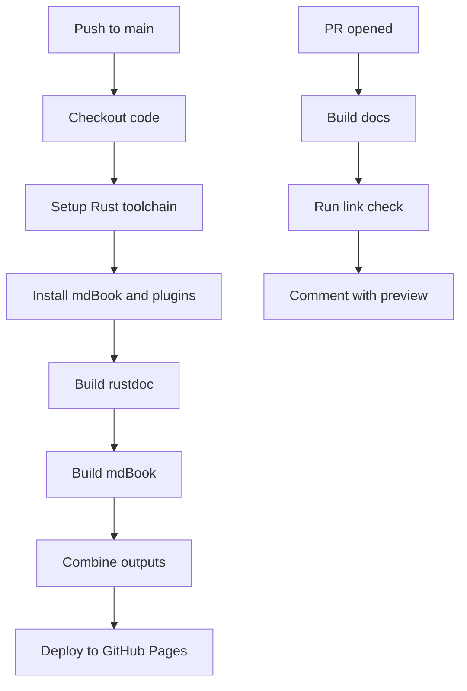
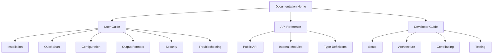

# Design Document

## Overview

This design establishes a comprehensive documentation system for Gold Digger that combines user-focused guides (mdBook) with API documentation (rustdoc) in a unified GitHub Pages site. The system will provide a seamless experience for both end users learning to use the tool and developers contributing to the codebase.

The documentation architecture follows a dual-purpose approach:

- **User Documentation**: mdBook-powered guides covering installation, usage, configuration, and troubleshooting
- **Developer Documentation**: rustdoc-generated API documentation with cross-references to user guides
- **Unified Deployment**: Single GitHub Pages site serving both documentation types with consistent navigation

## Architecture

### Directory Structure

```text
docs/
├── book.toml                    # mdBook configuration
├── src/                         # mdBook source files
│   ├── SUMMARY.md              # Table of contents
│   ├── introduction.md         # Landing page
│   ├── installation/           # Installation guides
│   │   ├── README.md
│   │   ├── windows.md
│   │   ├── macos.md
│   │   └── linux.md
│   ├── usage/                  # Usage documentation
│   │   ├── README.md
│   │   ├── quick-start.md
│   │   ├── configuration.md
│   │   ├── output-formats.md
│   │   └── examples.md
│   ├── security/               # Security considerations
│   │   ├── README.md
│   │   ├── database-security.md
│   │   ├── tls-ssl.md
│   │   └── best-practices.md
│   ├── development/            # Developer guides
│   │   ├── README.md
│   │   ├── setup.md
│   │   ├── contributing.md
│   │   ├── architecture.md
│   │   └── api-reference.md    # Links to rustdoc
│   └── troubleshooting/        # Common issues
│       ├── README.md
│       ├── connection-issues.md
│       ├── type-errors.md
│       └── performance.md
├── theme/                      # Custom styling (optional)
└── book/                       # Generated output (gitignored)
    ├── index.html              # mdBook output
    ├── api/                    # rustdoc output
    └── ...
```

### Plugin Integration

The mdBook setup will include seven key plugins:

**Core Plugins (Required):**

1. **mdbook-admonish**: Provides styled callout boxes for notes, warnings, tips, and important information
2. **mdbook-mermaid**: Enables diagram rendering for architecture and flow diagrams
3. **mdbook-linkcheck**: Validates all internal and external links during build
4. **mdbook-toc**: Automatically generates table of contents for long pages
5. **mdbook-open-on-gh**: Adds "Edit this page on GitHub" links to every page for easy contribution
6. **mdbook-tabs**: Enables tabbed content for platform-specific instructions (Windows/macOS/Linux)
7. **mdbook-i18n-helpers**: Provides infrastructure for future internationalization

**Optional Plugins (Future Consideration):**

- **mdbook-katex**: LaTeX math rendering (not immediately needed for Gold Digger)
- **mdbook-template**: Template system for reusable content blocks

### GitHub Actions Workflow

The deployment uses GitHub Actions with the following workflow:



## Components and Interfaces

### mdBook Configuration (book.toml)

```toml
[book]
authors = ["UncleSp1d3r"]
language = "en"
multilingual = false
src = "src"
title = "Gold Digger Documentation"
description = "MySQL/MariaDB query tool with structured output"

[build]
build-dir = "book"
create-missing = true

[output.html]
default-theme = "navy"
preferred-dark-theme = "navy"
git-repository-url = "https://github.com/UncleSp1d3r/gold_digger"
edit-url-template = "https://github.com/UncleSp1d3r/gold_digger/edit/main/docs/src/{path}"

[output.html.fold]
enable = true
level = 1

[output.html.playground]
runnable = false

[preprocessor.admonish]
command = "mdbook-admonish"
assets_version = "3.0.0"

[preprocessor.mermaid]
command = "mdbook-mermaid"

[preprocessor.toc]
command = "mdbook-toc"
renderer = ["html"]

[preprocessor.linkcheck]
command = "mdbook-linkcheck"

[preprocessor.open-on-gh]
command = "mdbook-open-on-gh"

[preprocessor.tabs]
command = "mdbook-tabs"

[preprocessor.i18n-helpers]
command = "mdbook-i18n-helpers"
```

### Justfile Integration

New recipes will be added to the existing justfile:

```just
# Documentation commands
docs-install:
    cargo install mdbook mdbook-admonish mdbook-mermaid mdbook-linkcheck mdbook-toc mdbook-open-on-gh mdbook-tabs mdbook-i18n-helpers

docs-build:
    #!/usr/bin/env bash
    set -euo pipefail
    # Build rustdoc
    cargo doc --no-deps --document-private-items --target-dir docs/book/api-temp
    # Move rustdoc output to final location
    mkdir -p docs/book/api
    cp -r docs/book/api-temp/doc/* docs/book/api/
    rm -rf docs/book/api-temp
    # Build mdBook
    cd docs && mdbook build

docs-serve:
    cd docs && mdbook serve --open

docs-clean:
    rm -rf docs/book target/doc

docs-check:
    #!/usr/bin/env bash
    set -euo pipefail
    cd docs
    mdbook build
    # Check formatting of markdown files
    find src -name "*.md" -exec mdformat --check {} \;
```

### GitHub Actions Workflow

```yaml
name: Deploy Documentation

on:
  push:
    branches: [main]
  pull_request:
    branches: [main]

permissions:
  contents: read
  pages: write
  id-token: write

concurrency:
  group: pages
  cancel-in-progress: false

jobs:
  build:
    runs-on: ubuntu-latest
    steps:
      - name: Checkout
        uses: actions/checkout@v4

      - name: Setup Rust
        uses: dtolnay/rust-toolchain@stable

      - name: Setup mdBook
        uses: jontze/action-mdbook@v3
        with:
          token: ${{ secrets.GITHUB_TOKEN }}
          mdbook-version: latest
          use-linkcheck: true
          use-mermaid: true
          use-toc: true
          use-admonish: true
          use-open-on-gh: true

      - name: Install additional plugins
        run: cargo install mdbook-open-on-gh mdbook-tabs mdbook-i18n-helpers

      - name: Build rustdoc
        run: |
          cargo doc --no-deps --document-private-items --target-dir target
          mkdir -p docs/book/api
          cp -r target/doc/* docs/book/api/

      - name: Build mdBook
        run: |
          cd docs
          mdbook build

      - name: Setup Pages
        if: github.ref == 'refs/heads/main'
        uses: actions/configure-pages@v4

      - name: Upload artifact
        if: github.ref == 'refs/heads/main'
        uses: actions/upload-pages-artifact@v3
        with:
          path: docs/book

  deploy:
    if: github.ref == 'refs/heads/main'
    environment:
      name: github-pages
      url: ${{ steps.deployment.outputs.page_url }}
    runs-on: ubuntu-latest
    needs: build
    steps:
      - name: Deploy to GitHub Pages
        id: deployment
        uses: actions/deploy-pages@v4
```

## Data Models

### Navigation Structure

The documentation follows a hierarchical structure optimized for different user types:



### Content Types and Templates

1. **Installation Pages**: Step-by-step platform-specific instructions with tabbed content for different platforms
2. **Usage Pages**: Practical examples with input/output samples and admonitions for important notes
3. **Security Pages**: Warning admonitions with best practices and security checklists
4. **API Pages**: Cross-references between mdBook and rustdoc with "Edit on GitHub" links
5. **Troubleshooting Pages**: Problem/solution format with diagnostic steps and expandable sections

### Cross-Reference System

Links between mdBook and rustdoc will follow these patterns:

- mdBook → rustdoc: `[function_name](../api/gold_digger/fn.function_name.html)`
- rustdoc → mdBook: Via `#[doc]` attributes with relative links
- Internal mdBook: Standard mdBook linking syntax

## Error Handling

### Build Failure Scenarios

1. **Link Check Failures**:

   - Broken internal links fail the build
   - External links generate warnings but don't fail
   - Provide clear error messages with file and line numbers

2. **Plugin Installation Failures**:

   - Graceful degradation when optional plugins fail
   - Clear error messages for required plugins
   - Fallback to basic mdBook if plugins unavailable

3. **Rustdoc Generation Failures**:

   - Separate rustdoc build from mdBook build
   - Continue with mdBook-only build if rustdoc fails
   - Log rustdoc errors without failing entire pipeline

### Content Validation

1. **Markdown Formatting**:

   - mdformat compatibility with mdBook syntax
   - Preserve mdBook-specific extensions (admonitions, includes)
   - Custom mdformat configuration for documentation

2. **Version Synchronization**:

   - Automated version extraction from Cargo.toml
   - Template variables for version-specific content
   - Validation that examples match current CLI interface

## Testing Strategy

### Automated Testing

1. **Link Validation**: mdbook-linkcheck runs on every build
2. **Content Testing**: Validate code examples are executable
3. **Cross-Reference Testing**: Ensure mdBook ↔ rustdoc links work
4. **Deployment Testing**: Verify GitHub Pages deployment succeeds

### Manual Testing Checklist

1. **Navigation**: All menu items and cross-references work
2. **Responsive Design**: Documentation renders correctly on mobile
3. **Search Functionality**: Built-in search finds relevant content
4. **Plugin Features**: Admonitions, diagrams, and TOC render correctly

### Content Quality Assurance

1. **Technical Accuracy**: Examples match current codebase
2. **Completeness**: All CLI flags and features documented
3. **Clarity**: User guides tested with fresh users
4. **Security**: Security warnings prominently displayed

## Integration Points

### Existing Project Integration

1. **Justfile Integration**: Documentation commands follow existing patterns
2. **CI/CD Integration**: Reuse existing quality gates and tooling
3. **Version Management**: Sync with existing Cargo.toml versioning
4. **Code Quality**: Respect existing formatting and linting standards

### mdformat Configuration

Update `.mdformat.toml` to preserve mdBook syntax:

```toml
[tool.mdformat]
wrap = 100
number = false

[tool.mdformat.plugin.mdbook]
# Preserve mdBook-specific syntax
preserve_includes = true
preserve_admonitions = true
preserve_mermaid = true
```

### Pre-commit Integration

Add documentation checks to `.pre-commit-config.yaml`:

```yaml
  - repo: local
    hooks:
      - id: docs-linkcheck
        name: Documentation link check
        entry: bash -c 'cd docs && mdbook build'
        language: system
        files: ^docs/
        pass_filenames: false
```

This design provides a comprehensive documentation system that serves both users and developers while integrating seamlessly with Gold Digger's existing development workflow and quality standards.
