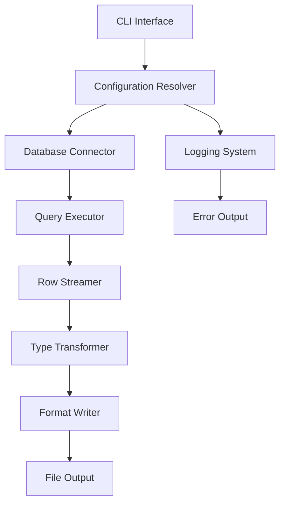

# Design Document

## Overview

Gold Digger is architected as a single-purpose CLI tool that transforms MySQL/MariaDB query results into structured output formats. The design emphasizes reliability, security, and composability for automation workflows.

### Design Principles

- **Offline-first**: No external service dependencies at runtime
- **Fail-fast**: Clear error messages with standardized exit codes
- **Memory-efficient**: Streaming processing for large result sets
- **Security-focused**: Credential protection and safe type handling
- **Pipeline-friendly**: Deterministic output formats and exit codes

## Architecture

### High-Level Architecture



### Component Responsibilities

1. **CLI Interface**: Argument parsing, validation, and help generation
2. **Configuration Resolver**: Precedence handling and environment integration
3. **Database Connector**: Connection management with TLS support
4. **Query Executor**: SQL execution with error handling
5. **Row Streamer**: Memory-efficient result processing
6. **Type Transformer**: Safe MySQL type to string conversion
7. **Format Writer**: Pluggable output format generation
8. **Logging System**: Structured logging with credential redaction

## Dependencies

### Core Dependencies

```toml
[dependencies]
clap = { version = "4.0", features = ["derive", "env"] }
clap_complete = "4.0"
mysql = { version = "24.0", features = ["native-tls"] }
csv = "1.3"
serde_json = "1.0"
anyhow = "1.0"
tracing = "0.1"
tracing-subscriber = { version = "0.3", features = ["env-filter"] }
url = "2.4"

[features]
default = ["json", "csv", "ssl", "additional_mysql_types", "verbose"]
json = []
csv = []
ssl = ["mysql/native-tls"]
ssl-rustls = ["mysql/rustls-tls"]
additional_mysql_types = [
  "mysql_common/bigdecimal",
  "mysql_common/rust_decimal",
  "mysql_common/chrono",
  "mysql_common/uuid",
]
verbose = []
```

### Design Rationale for Dependencies

- **clap**: Provides robust CLI parsing with environment variable fallback support
- **mysql**: Primary database driver with TLS support via native-tls feature
- **tracing**: Structured logging with zero-cost abstractions and credential protection
- **csv**: RFC 4180 compliant CSV output with configurable quoting
- **serde_json**: JSON serialization with BTreeMap for deterministic output
- **anyhow**: Ergonomic error handling and context propagation

## Components and Interfaces

### CLI Interface Module

```rust
use clap::{Parser, Subcommand, ValueEnum};
use clap_complete::Shell;
use std::collections::BTreeMap;
use std::io::Write;
use std::path::PathBuf;

#[derive(Parser)]
#[command(name = "gold_digger")]
#[command(about = "MySQL/MariaDB query tool with structured output")]
pub struct Cli {
    /// Database connection URL
    #[arg(long, env = "DATABASE_URL")]
    pub db_url: Option<String>,

    /// SQL query string
    #[arg(long, conflicts_with = "query_file")]
    pub query: Option<String>,

    /// File containing SQL query
    #[arg(long, conflicts_with = "query")]
    pub query_file: Option<PathBuf>,

    /// Output file path
    #[arg(short, long, env = "OUTPUT_FILE")]
    pub output: Option<PathBuf>,

    /// Output format override
    #[arg(long, value_enum)]
    pub format: Option<OutputFormat>,

    /// Enable verbose logging
    #[arg(short, long, action = clap::ArgAction::Count)]
    pub verbose: u8,

    /// Suppress all output except errors
    #[arg(long, conflicts_with = "verbose")]
    pub quiet: bool,

    /// Pretty-print JSON output
    #[arg(long)]
    pub pretty: bool,

    /// Exit successfully on empty result sets
    #[arg(long)]
    pub allow_empty: bool,

    /// Print current configuration as JSON
    #[arg(long)]
    pub dump_config: bool,

    /// Generate shell completion scripts
    #[command(subcommand)]
    pub command: Option<Commands>,
}

#[derive(Subcommand)]
pub enum Commands {
    /// Generate shell completion scripts
    Completion {
        #[arg(value_enum)]
        shell: Shell,
    },
}
```

### Configuration System

```rust
#[derive(Debug, Clone)]
pub struct Config {
    pub database_url: String,
    pub query: String,
    pub output_path: PathBuf,
    pub format: OutputFormat,
    pub verbose_level: u8,
    pub quiet: bool,
    pub pretty_json: bool,
    pub allow_empty: bool,
}

impl Config {
    pub fn resolve(cli: Cli) -> Result<Self> {
        // Implement precedence: CLI flags > env vars > defaults
        // Validate required fields and mutual exclusions
    }

    pub fn to_json(&self) -> Result<String> {
        use serde_json::json;

        let config_json = json!({
            "database_url": RedactedUrl::new(self.database_url.clone()).to_string(),
            "query": if self.query.len() > 100 {
                format!("{}... ({} chars)", &self.query[..97], self.query.len())
            } else {
                self.query.clone()
            },
            "output_path": self.output_path,
            "format": match self.format {
                OutputFormat::Csv => "csv",
                OutputFormat::Json => "json",
                OutputFormat::Tsv => "tsv",
            },
            "verbose_level": self.verbose_level,
            "quiet": self.quiet,
            "pretty_json": self.pretty_json,
            "allow_empty": self.allow_empty
        });

        serde_json::to_string_pretty(&config_json).map_err(|e| GoldDiggerError::Format(Box::new(e)))
    }
}
```

### Database Connection Module

```rust
use mysql::{OptsBuilder, Pool, PooledConn, SslOpts};

pub struct DatabaseConnector {
    pool: Pool,
}

impl DatabaseConnector {
    pub fn new(database_url: &str) -> Result<Self> {
        let opts = OptsBuilder::from_opts(Opts::from_url(database_url)?).ssl_opts(SslOpts::default());

        let pool = Pool::new(opts)?;
        Ok(Self { pool })
    }

    pub fn get_connection(&self) -> Result<PooledConn> {
        self.pool.get_conn().map_err(|e| GoldDiggerError::Connection(e))
    }
}
```

### Query Execution and Streaming

```rust
use mysql::{prelude::Queryable, QueryResult, Row};
use tracing::{debug, error, info};

pub struct QueryExecutor {
    conn: PooledConn,
}

impl QueryExecutor {
    pub fn new(conn: PooledConn) -> Self {
        Self { conn }
    }

    pub fn execute_streaming(&mut self, query: &str) -> Result<RowStream> {
        info!("Executing query with streaming mode");
        debug!("Query length: {} characters", query.len());

        let result = self.conn.query_iter(query).map_err(|e| {
            error!("Query execution failed: {}", e);
            GoldDiggerError::Query(e)
        })?;

        Ok(RowStream::new(result))
    }
}

pub struct RowStream<'a> {
    result: mysql::QueryResult<'a>,
    columns: Vec<mysql::consts::Column>,
    row_count: usize,
}

impl<'a> RowStream<'a> {
    pub fn new(mut result: mysql::QueryResult<'a>) -> Self {
        let columns = result.columns().to_vec();
        info!("Query returned {} columns", columns.len());

        Self {
            result,
            columns,
            row_count: 0,
        }
    }

    pub fn columns(&self) -> &[mysql::consts::Column] {
        &self.columns
    }
}

impl<'a> Iterator for RowStream<'a> {
    type Item = Result<Vec<String>>;

    fn next(&mut self) -> Option<Self::Item> {
        match self.result.next() {
            Some(Ok(row)) => {
                self.row_count += 1;
                if self.row_count % 10000 == 0 {
                    debug!("Processed {} rows", self.row_count);
                }
                Some(TypeTransformer::row_to_strings(row, &self.columns))
            },
            Some(Err(e)) => {
                error!("Error reading row {}: {}", self.row_count + 1, e);
                Some(Err(GoldDiggerError::Query(e)))
            },
            None => {
                info!("Completed processing {} rows", self.row_count);
                None
            },
        }
    }
}
```

### Type Transformation System

```rust
use mysql::{consts::Column, from_value_opt, Row, Value};
use tracing::{debug, warn};

pub struct TypeTransformer;

impl TypeTransformer {
    /// Safely converts a MySQL row to a vector of strings
    /// This function handles NULL values and type conversion errors gracefully
    /// to prevent panics that could occur with unsafe value access
    pub fn row_to_strings(row: Row, columns: &[Column]) -> Result<Vec<String>> {
        let mut values = Vec::with_capacity(columns.len());

        for (index, column) in columns.iter().enumerate() {
            let value = row.get_opt::<Value, _>(index).unwrap_or(Some(Value::NULL));

            let string_value = match value {
                Some(Value::NULL) => {
                    debug!("NULL value found in column '{}'", column.name_str());
                    String::new()
                },
                Some(val) => Self::value_to_string(val, column.name_str())?,
                None => {
                    warn!("Unexpected None value in column '{}'", column.name_str());
                    String::new()
                },
            };

            values.push(string_value);
        }

        Ok(values)
    }

    /// Safely converts MySQL Value to String with comprehensive type support
    /// Handles all MySQL data types including extended types when feature is enabled
    fn value_to_string(value: Value, column_name: &str) -> Result<String> {
        match value {
            Value::NULL => Ok(String::new()),
            Value::Bytes(bytes) => String::from_utf8(bytes).map_err(|e| {
                warn!("UTF-8 conversion failed for column '{}': {}", column_name, e);
                GoldDiggerError::TypeConversion
            }),
            Value::Int(i) => Ok(i.to_string()),
            Value::UInt(u) => Ok(u.to_string()),
            Value::Float(f) => {
                if f.is_finite() {
                    Ok(f.to_string())
                } else {
                    warn!("Non-finite float value in column '{}': {}", column_name, f);
                    Ok(f.to_string()) // Still convert, but log the issue
                }
            },
            Value::Double(d) => {
                if d.is_finite() {
                    Ok(d.to_string())
                } else {
                    warn!("Non-finite double value in column '{}': {}", column_name, d);
                    Ok(d.to_string()) // Still convert, but log the issue
                }
            },
            Value::Date(year, month, day, hour, minute, second, microsecond) => Ok(format!(
                "{:04}-{:02}-{:02} {:02}:{:02}:{:02}.{:06}",
                year, month, day, hour, minute, second, microsecond
            )),
            Value::Time(neg, days, hours, minutes, seconds, microseconds) => {
                let sign = if neg { "-" } else { "" };
                Ok(format!(
                    "{}{}:{:02}:{:02}:{:02}.{:06}",
                    sign,
                    days * 24 + hours as u32,
                    minutes,
                    seconds,
                    microseconds
                ))
            },
        }
    }

    /// Converts MySQL Value to JSON Value for JSON output format
    /// Preserves type information where possible
    pub fn value_to_json(value: Value) -> serde_json::Value {
        match value {
            Value::NULL => serde_json::Value::Null,
            Value::Bytes(bytes) => match String::from_utf8(bytes) {
                Ok(s) => serde_json::Value::String(s),
                Err(_) => serde_json::Value::String(format!("<binary data>")),
            },
            Value::Int(i) => serde_json::Value::Number(i.into()),
            Value::UInt(u) => {
                if let Ok(num) = serde_json::Number::from_f64(u as f64) {
                    serde_json::Value::Number(num)
                } else {
                    serde_json::Value::String(u.to_string())
                }
            },
            Value::Float(f) => {
                if let Some(num) = serde_json::Number::from_f64(f as f64) {
                    serde_json::Value::Number(num)
                } else {
                    serde_json::Value::String(f.to_string())
                }
            },
            Value::Double(d) => {
                if let Some(num) = serde_json::Number::from_f64(d) {
                    serde_json::Value::Number(num)
                } else {
                    serde_json::Value::String(d.to_string())
                }
            },
            _ => serde_json::Value::String(Self::value_to_string(value, "").unwrap_or_default()),
        }
    }
}
```

### Format Writers

```rust
use tracing::{debug, info};

pub trait FormatWriter {
    fn write_header(&mut self, columns: &[String]) -> Result<()>;
    fn write_row(&mut self, row: &[String]) -> Result<()>;
    fn finalize(self) -> Result<()>;
}

pub fn create_format_writer<W: Write>(format: OutputFormat, writer: W, pretty: bool) -> Box<dyn FormatWriter> {
    match format {
        OutputFormat::Csv => {
            info!("Creating CSV writer with RFC 4180 compliance");
            Box::new(CsvWriter::new(writer))
        },
        OutputFormat::Json => {
            info!("Creating JSON writer with {} formatting", if pretty { "pretty" } else { "compact" });
            Box::new(JsonWriter::new(writer, pretty))
        },
        OutputFormat::Tsv => {
            info!("Creating TSV writer with tab delimiters");
            Box::new(TsvWriter::new(writer))
        },
    }
}

pub struct CsvWriter<W: Write> {
    writer: csv::Writer<W>,
}

impl<W: Write> FormatWriter for CsvWriter<W> {
    fn write_header(&mut self, columns: &[String]) -> Result<()> {
        self.writer.write_record(columns)?;
        Ok(())
    }

    fn write_row(&mut self, row: &[String]) -> Result<()> {
        self.writer.write_record(row)?;
        Ok(())
    }

    fn finalize(mut self) -> Result<()> {
        self.writer.flush()?;
        Ok(())
    }
}

pub struct TsvWriter<W: Write> {
    writer: csv::Writer<W>,
    row_count: usize,
}

impl<W: Write> TsvWriter<W> {
    pub fn new(writer: W) -> Self {
        let csv_writer = csv::WriterBuilder::new()
            .delimiter(b'\t')
            .quote_style(csv::QuoteStyle::Necessary)
            .from_writer(writer);

        Self {
            writer: csv_writer,
            row_count: 0,
        }
    }
}

impl<W: Write> FormatWriter for TsvWriter<W> {
    fn write_header(&mut self, columns: &[String]) -> Result<()> {
        debug!("TSV writer initialized with {} columns", columns.len());
        self.writer.write_record(columns)?;
        Ok(())
    }

    fn write_row(&mut self, row: &[String]) -> Result<()> {
        self.row_count += 1;
        if self.row_count % 10000 == 0 {
            debug!("TSV writer processed {} rows", self.row_count);
        }
        self.writer.write_record(row)?;
        Ok(())
    }

    fn finalize(mut self) -> Result<()> {
        self.writer.flush()?;
        info!("TSV writer completed with {} rows", self.row_count);
        Ok(())
    }
}

pub struct JsonWriter<W: Write> {
    writer: W,
    first_row: bool,
    pretty: bool,
    columns: Vec<String>,
    row_count: usize,
}

impl<W: Write> JsonWriter<W> {
    pub fn new(writer: W, pretty: bool) -> Self {
        Self {
            writer,
            first_row: true,
            pretty,
            columns: Vec::new(),
            row_count: 0,
        }
    }
}

impl<W: Write> FormatWriter for JsonWriter<W> {
    fn write_header(&mut self, columns: &[String]) -> Result<()> {
        self.columns = columns.to_vec();
        debug!("JSON writer initialized with {} columns", columns.len());
        write!(self.writer, r#"{{"data":["#)?;
        Ok(())
    }

    fn write_row(&mut self, row: &[String]) -> Result<()> {
        if !self.first_row {
            write!(self.writer, ",")?;
        }
        self.first_row = false;
        self.row_count += 1;

        if self.row_count % 10000 == 0 {
            debug!("JSON writer processed {} rows", self.row_count);
        }

        // Create ordered map for deterministic output using BTreeMap
        let mut obj = BTreeMap::new();
        for (col, val) in self.columns.iter().zip(row.iter()) {
            obj.insert(col.clone(), val.clone());
        }

        if self.pretty {
            serde_json::to_writer_pretty(&mut self.writer, &obj)?;
        } else {
            serde_json::to_writer(&mut self.writer, &obj)?;
        }

        Ok(())
    }

    fn finalize(mut self) -> Result<()> {
        write!(self.writer, "]}")?;
        info!("JSON writer completed with {} rows", self.row_count);
        Ok(())
    }
}
```

## Data Models

### Error Taxonomy

```rust
#[derive(Debug, thiserror::Error)]
pub enum GoldDiggerError {
    #[error("Configuration error: {0}")]
    Config(String),

    #[error("Database connection failed: {0}")]
    Connection(#[source] mysql::Error),

    #[error("Query execution failed: {0}")]
    Query(#[source] mysql::Error),

    #[error("File I/O error: {0}")]
    Io(#[from] std::io::Error),

    #[error("Type conversion error")]
    TypeConversion,

    #[error("Format serialization error: {0}")]
    Format(#[source] Box<dyn std::error::Error + Send + Sync>),
}

impl GoldDiggerError {
    pub fn exit_code(&self) -> i32 {
        match self {
            Self::Config(_) => 2,
            Self::Connection(_) => 3,
            Self::Query(_) => 4,
            Self::Io(_) => 5,
            Self::TypeConversion => 4,
            Self::Format(_) => 5,
        }
    }
}
```

### Output Format Enumeration

```rust
#[derive(Debug, Clone, Copy, ValueEnum)]
pub enum OutputFormat {
    Csv,
    Json,
    Tsv,
}

impl OutputFormat {
    pub fn from_extension(path: &Path) -> Self {
        match path.extension().and_then(|s| s.to_str()) {
            Some("csv") => Self::Csv,
            Some("json") => Self::Json,
            _ => Self::Tsv, // Default fallback
        }
    }
}
```

## Error Handling

### Error Propagation Strategy

1. **Parse Errors**: CLI validation errors exit immediately with code 2
2. **Connection Errors**: Database connectivity issues exit with code 3
3. **Query Errors**: SQL execution failures exit with code 4
4. **I/O Errors**: File operations failures exit with code 5
5. **Empty Results**: Configurable behavior via --allow-empty flag

### Structured Logging and Credential Protection

```rust
use tracing::{debug, error, info, instrument, warn};
use url::Url;

/// Wrapper for database URLs that automatically redacts credentials in logs
pub struct RedactedUrl(String);

impl RedactedUrl {
    pub fn new(url: String) -> Self {
        Self(url)
    }

    pub fn as_str(&self) -> &str {
        &self.0
    }
}

impl fmt::Display for RedactedUrl {
    fn fmt(&self, f: &mut fmt::Formatter<'_>) -> fmt::Result {
        match Url::parse(&self.0) {
            Ok(url) => {
                let host = url.host_str().unwrap_or("***");
                let port = url.port().map(|p| format!(":{}", p)).unwrap_or_default();
                write!(f, "{}://***@{}{}", url.scheme(), host, port)
            },
            Err(_) => write!(f, "***INVALID_URL***"),
        }
    }
}

/// Logging configuration based on CLI flags
pub struct LoggingConfig {
    pub verbose_level: u8,
    pub quiet: bool,
}

impl LoggingConfig {
    pub fn init_tracing(&self) -> Result<()> {
        use tracing_subscriber::{fmt, prelude::*, EnvFilter};

        if self.quiet {
            // Only show errors when quiet mode is enabled
            let filter = EnvFilter::new("error");
            tracing_subscriber::registry()
                .with(fmt::layer().with_target(false))
                .with(filter)
                .init();
        } else {
            let level = match self.verbose_level {
                0 => "warn",
                1 => "info",
                2 => "debug",
                _ => "trace",
            };

            let filter = EnvFilter::new(format!("gold_digger={}", level));
            tracing_subscriber::registry()
                .with(fmt::layer().with_target(false))
                .with(filter)
                .init();
        }

        Ok(())
    }
}

/// Instrument database operations with structured logging
#[instrument(skip(database_url), fields(db_host = %RedactedUrl::new(database_url.to_string())))]
pub fn connect_to_database(database_url: &str) -> Result<DatabaseConnector> {
    info!("Establishing database connection");
    DatabaseConnector::new(database_url)
}

#[instrument(skip(query), fields(query_len = query.len()))]
pub fn execute_query(executor: &mut QueryExecutor, query: &str) -> Result<RowStream> {
    info!("Executing database query");
    executor.execute_streaming(query)
}
```

## Testing Strategy

### Unit Testing

- **Type Transformer**: Test safe conversion of all MySQL types including NULL values
- **Format Writers**: Validate RFC compliance and deterministic output
- **Configuration Resolver**: Test precedence rules and validation logic
- **Error Handling**: Verify correct exit codes for all error conditions

### Integration Testing

- **Database Connectivity**: Use testcontainers for MySQL/MariaDB testing
- **End-to-End CLI**: Use assert_cmd for complete workflow testing
- **Format Validation**: Use insta for snapshot testing of output formats

### Property Testing

- **Type Safety**: Use proptest to verify no panics on arbitrary MySQL values
- **Output Determinism**: Verify consistent output across multiple runs

### Performance Testing

- **Memory Usage**: Benchmark streaming vs. materialized approaches
- **Startup Time**: Ensure CLI initialization under 250ms
- **Large Result Sets**: Test with multi-GB result sets

## Security Considerations

### Credential Handling

- Never log DATABASE_URL contents
- Redact connection strings in error messages
- Support secure environment variable passing
- No credential persistence or caching

### Input Validation

- Validate file paths for directory traversal
- Sanitize error messages to prevent information disclosure
- Proper handling of special characters in output formats

### Memory Safety

- Use Rust's ownership system to prevent buffer overflows
- Avoid unsafe code blocks
- Proper resource cleanup on error conditions

## Performance Characteristics

### Memory Usage

- **Streaming Mode**: O(row_width) memory usage - processes one row at a time
- **Connection Pooling**: Single connection per execution (no pooling optimization)
- **Buffer Management**: Configurable write buffer sizes for output formats
- **Type Conversion**: Zero-copy string conversion where possible

### Startup Performance

- **Lazy Loading**: Initialize components only when needed
- **Minimal Dependencies**: Reduce binary size and startup time under 250ms
- **Efficient Argument Parsing**: Use clap's derive macros for speed
- **Tracing Initialization**: Conditional logging setup based on verbosity flags

### Scalability Limits

- **File Size**: Support up to 2GB output files (filesystem dependent)
- **Row Count**: No theoretical limit with streaming architecture
- **Column Count**: Limited by MySQL protocol (4096 columns maximum)
- **Connection Timeout**: Configurable via database URL parameters
- **Memory Scaling**: Linear with row width, constant with row count

### Logging Performance

- **Structured Logging**: Uses tracing crate for zero-cost abstractions when disabled
- **Credential Redaction**: Automatic URL sanitization with minimal overhead
- **Log Levels**: Configurable verbosity (warn/info/debug/trace) via --verbose flag
- **Quiet Mode**: Complete log suppression except errors via --quiet flag
