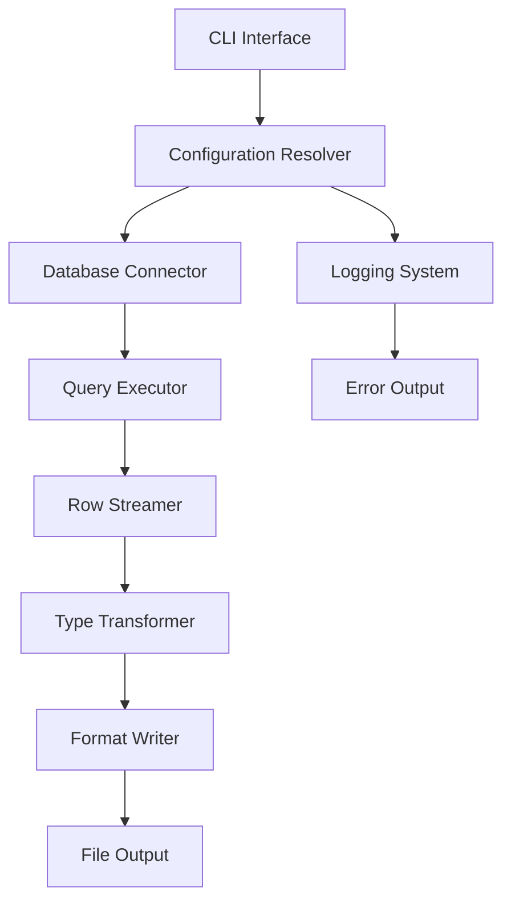

# Design Document

## Overview

Gold Digger is architected as a single-purpose CLI tool that transforms MySQL/MariaDB query results into structured output formats. The design emphasizes reliability, security, and composability for automation workflows.

### Design Principles

- **Offline-first**: No external service dependencies at runtime
- **Fail-fast**: Clear error messages with standardized exit codes
- **Memory-efficient**: Streaming processing for large result sets
- **Security-focused**: Credential protection and safe type handling
- **Pipeline-friendly**: Deterministic output formats and exit codes

## Architecture

### High-Level Architecture



### Component Responsibilities

1. **CLI Interface**: Argument parsing, validation, and help generation
2. **Configuration Resolver**: Precedence handling and environment integration
3. **Database Connector**: Connection management with TLS support
4. **Query Executor**: SQL execution with error handling
5. **Row Streamer**: Memory-efficient result processing
6. **Type Transformer**: Safe MySQL type to string conversion
7. **Format Writer**: Pluggable output format generation
8. **Logging System**: Structured logging with credential redaction

## Components and Interfaces

### CLI Interface Module

```rust
use clap::{Parser, Subcommand};
use std::collections::BTreeMap;
use std::io::Write;

#[derive(Parser)]
#[command(name = "gold_digger")]
#[command(about = "MySQL/MariaDB query tool with structured output")]
pub struct Cli {
    /// Database connection URL
    #[arg(long, env = "DATABASE_URL")]
    pub db_url: Option<String>,

    /// SQL query string
    #[arg(long, conflicts_with = "query_file")]
    pub query: Option<String>,

    /// File containing SQL query
    #[arg(long, conflicts_with = "query")]
    pub query_file: Option<PathBuf>,

    /// Output file path
    #[arg(short, long, env = "OUTPUT_FILE")]
    pub output: Option<PathBuf>,

    /// Output format override
    #[arg(long, value_enum)]
    pub format: Option<OutputFormat>,

    /// Enable verbose logging
    #[arg(short, long, action = clap::ArgAction::Count)]
    pub verbose: u8,

    /// Suppress all output except errors
    #[arg(long, conflicts_with = "verbose")]
    pub quiet: bool,

    /// Pretty-print JSON output
    #[arg(long)]
    pub pretty: bool,

    /// Exit successfully on empty result sets
    #[arg(long)]
    pub allow_empty: bool,

    /// Print current configuration as JSON
    #[arg(long)]
    pub dump_config: bool,

    #[command(subcommand)]
    pub command: Option<Commands>,
}

#[derive(Subcommand)]
pub enum Commands {
    /// Generate shell completion scripts
    Completion {
        #[arg(value_enum)]
        shell: Shell,
    },
}
```

### Configuration System

```rust
#[derive(Debug, Clone)]
pub struct Config {
    pub database_url: String,
    pub query: String,
    pub output_path: PathBuf,
    pub format: OutputFormat,
    pub verbose_level: u8,
    pub quiet: bool,
    pub pretty_json: bool,
    pub allow_empty: bool,
}

impl Config {
    pub fn resolve(cli: Cli) -> Result<Self> {
        // Implement precedence: CLI flags > env vars > defaults
        // Validate required fields and mutual exclusions
    }

    pub fn to_json(&self) -> Result<String> {
        // Serialize config for --dump-config (redact sensitive data)
    }
}
```

### Database Connection Module

```rust
use mysql::{OptsBuilder, Pool, PooledConn, SslOpts};

pub struct DatabaseConnector {
    pool: Pool,
}

impl DatabaseConnector {
    pub fn new(database_url: &str) -> Result<Self> {
        let opts = OptsBuilder::from_opts(Opts::from_url(database_url)?).ssl_opts(SslOpts::default());

        let pool = Pool::new(opts)?;
        Ok(Self { pool })
    }

    pub fn get_connection(&self) -> Result<PooledConn> {
        self.pool.get_conn().map_err(|e| GoldDiggerError::Connection(e))
    }
}
```

### Query Execution and Streaming

```rust
use mysql::{QueryResult, Row};

pub struct QueryExecutor {
    conn: PooledConn,
}

impl QueryExecutor {
    pub fn execute_streaming(&mut self, query: &str) -> Result<RowStream> {
        let result = self.conn.query_iter(query).map_err(|e| GoldDiggerError::Query(e))?;

        Ok(RowStream::new(result))
    }
}

pub struct RowStream<'a> {
    result: mysql::QueryResult<'a>,
    columns: Vec<mysql::consts::Column>,
}

impl<'a> Iterator for RowStream<'a> {
    type Item = Result<Vec<String>>;

    fn next(&mut self) -> Option<Self::Item> {
        // Stream rows one at a time, converting to strings safely
    }
}
```

### Type Transformation System

```rust
use mysql::{from_value, Value};

pub struct TypeTransformer;

impl TypeTransformer {
    pub fn row_to_strings(row: Row, columns: &[Column]) -> Result<Vec<String>> {
        let mut values = Vec::with_capacity(columns.len());

        for column in columns {
            let value = row.get_opt(column.name_str().as_ref()).unwrap_or(Some(Value::NULL));

            let string_value = match value {
                Some(Value::NULL) => String::new(),
                Some(val) => Self::value_to_string(val)?,
                None => String::new(),
            };

            values.push(string_value);
        }

        Ok(values)
    }

    fn value_to_string(value: Value) -> Result<String> {
        match value {
            Value::NULL => Ok(String::new()),
            Value::Bytes(bytes) => String::from_utf8(bytes).map_err(|_| GoldDiggerError::TypeConversion),
            Value::Int(i) => Ok(i.to_string()),
            Value::UInt(u) => Ok(u.to_string()),
            Value::Float(f) => Ok(f.to_string()),
            Value::Double(d) => Ok(d.to_string()),
            Value::Date(year, month, day, hour, minute, second, microsecond) => Ok(format!(
                "{:04}-{:02}-{:02} {:02}:{:02}:{:02}.{:06}",
                year, month, day, hour, minute, second, microsecond
            )),
            Value::Time(neg, days, hours, minutes, seconds, microseconds) => {
                let sign = if neg { "-" } else { "" };
                Ok(format!(
                    "{}{}:{:02}:{:02}:{:02}.{:06}",
                    sign,
                    days * 24 + hours as u32,
                    minutes,
                    seconds,
                    microseconds
                ))
            },
        }
    }
}
```

### Format Writers

```rust
pub trait FormatWriter {
    fn write_header(&mut self, columns: &[String]) -> Result<()>;
    fn write_row(&mut self, row: &[String]) -> Result<()>;
    fn finalize(self) -> Result<()>;
}

pub struct CsvWriter<W: Write> {
    writer: csv::Writer<W>,
}

impl<W: Write> FormatWriter for CsvWriter<W> {
    fn write_header(&mut self, columns: &[String]) -> Result<()> {
        self.writer.write_record(columns)?;
        Ok(())
    }

    fn write_row(&mut self, row: &[String]) -> Result<()> {
        self.writer.write_record(row)?;
        Ok(())
    }

    fn finalize(mut self) -> Result<()> {
        self.writer.flush()?;
        Ok(())
    }
}

pub struct JsonWriter<W: Write> {
    writer: W,
    first_row: bool,
    pretty: bool,
    columns: Vec<String>,
}

impl<W: Write> FormatWriter for JsonWriter<W> {
    fn write_header(&mut self, columns: &[String]) -> Result<()> {
        self.columns = columns.to_vec();
        write!(self.writer, r#"{{"data":["#)?;
        Ok(())
    }

    fn write_row(&mut self, row: &[String]) -> Result<()> {
        if !self.first_row {
            write!(self.writer, ",")?;
        }
        self.first_row = false;

        // Create ordered map for deterministic output
        let mut obj = BTreeMap::new();
        for (col, val) in self.columns.iter().zip(row.iter()) {
            obj.insert(col.clone(), val.clone());
        }

        if self.pretty {
            serde_json::to_writer_pretty(&mut self.writer, &obj)?;
        } else {
            serde_json::to_writer(&mut self.writer, &obj)?;
        }

        Ok(())
    }

    fn finalize(mut self) -> Result<()> {
        write!(self.writer, "]}")?;
        Ok(())
    }
}
```

## Data Models

### Error Taxonomy

```rust
#[derive(Debug, thiserror::Error)]
pub enum GoldDiggerError {
    #[error("Configuration error: {0}")]
    Config(String),

    #[error("Database connection failed: {0}")]
    Connection(#[source] mysql::Error),

    #[error("Query execution failed: {0}")]
    Query(#[source] mysql::Error),

    #[error("File I/O error: {0}")]
    Io(#[from] std::io::Error),

    #[error("Type conversion error")]
    TypeConversion,

    #[error("Format serialization error: {0}")]
    Format(#[source] Box<dyn std::error::Error + Send + Sync>),
}

impl GoldDiggerError {
    pub fn exit_code(&self) -> i32 {
        match self {
            Self::Config(_) => 2,
            Self::Connection(_) => 3,
            Self::Query(_) => 4,
            Self::Io(_) => 5,
            Self::TypeConversion => 4,
            Self::Format(_) => 5,
        }
    }
}
```

### Output Format Enumeration

```rust
#[derive(Debug, Clone, Copy, ValueEnum)]
pub enum OutputFormat {
    Csv,
    Json,
    Tsv,
}

impl OutputFormat {
    pub fn from_extension(path: &Path) -> Self {
        match path.extension().and_then(|s| s.to_str()) {
            Some("csv") => Self::Csv,
            Some("json") => Self::Json,
            _ => Self::Tsv, // Default fallback
        }
    }
}
```

## Error Handling

### Error Propagation Strategy

1. **Parse Errors**: CLI validation errors exit immediately with code 2
2. **Connection Errors**: Database connectivity issues exit with code 3
3. **Query Errors**: SQL execution failures exit with code 4
4. **I/O Errors**: File operations failures exit with code 5
5. **Empty Results**: Configurable behavior via --allow-empty flag

### Credential Protection

```rust
pub struct RedactedUrl(String);

impl fmt::Display for RedactedUrl {
    fn fmt(&self, f: &mut fmt::Formatter<'_>) -> fmt::Result {
        let url = Url::parse(&self.0).map_err(|_| fmt::Error)?;
        write!(f, "{}://{}@{}", url.scheme(), "***", url.host_str().unwrap_or("***"))
    }
}
```

## Testing Strategy

### Unit Testing

- **Type Transformer**: Test safe conversion of all MySQL types including NULL values
- **Format Writers**: Validate RFC compliance and deterministic output
- **Configuration Resolver**: Test precedence rules and validation logic
- **Error Handling**: Verify correct exit codes for all error conditions

### Integration Testing

- **Database Connectivity**: Use testcontainers for MySQL/MariaDB testing
- **End-to-End CLI**: Use assert_cmd for complete workflow testing
- **Format Validation**: Use insta for snapshot testing of output formats

### Property Testing

- **Type Safety**: Use proptest to verify no panics on arbitrary MySQL values
- **Output Determinism**: Verify consistent output across multiple runs

### Performance Testing

- **Memory Usage**: Benchmark streaming vs. materialized approaches
- **Startup Time**: Ensure CLI initialization under 250ms
- **Large Result Sets**: Test with multi-GB result sets

## Security Considerations

### Credential Handling

- Never log DATABASE_URL contents
- Redact connection strings in error messages
- Support secure environment variable passing
- No credential persistence or caching

### Input Validation

- Validate file paths for directory traversal
- Sanitize error messages to prevent information disclosure
- Proper handling of special characters in output formats

### Memory Safety

- Use Rust's ownership system to prevent buffer overflows
- Avoid unsafe code blocks
- Proper resource cleanup on error conditions

## Performance Characteristics

### Memory Usage

- **Streaming Mode**: O(row_width) memory usage
- **Connection Pooling**: Reuse connections for multiple queries
- **Buffer Management**: Configurable write buffer sizes

### Startup Performance

- **Lazy Loading**: Initialize components only when needed
- **Minimal Dependencies**: Reduce binary size and startup time
- **Efficient Argument Parsing**: Use clap's derive macros for speed

### Scalability Limits

- **File Size**: Support up to 2GB output files (filesystem dependent)
- **Row Count**: No theoretical limit with streaming
- **Column Count**: Limited by MySQL protocol (4096 columns)
- **Connection Timeout**: Configurable via database URL parameters
