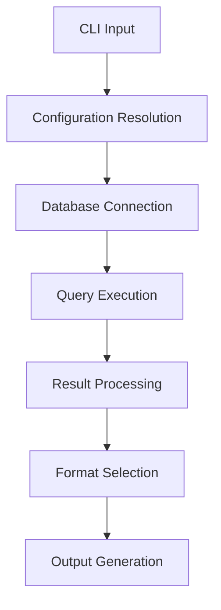
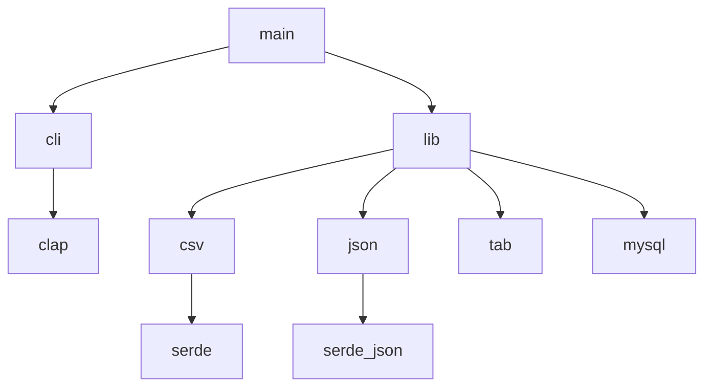

# Architecture

Gold Digger's architecture and design decisions.

## High-Level Architecture

## Core Components

### CLI Layer (`main.rs`, `cli.rs`)

- Argument parsing with clap
- Environment variable fallback
- Configuration validation

### Database Layer (`lib.rs`)

- MySQL connection management
- Query execution
- Result set processing

### Output Layer (`csv.rs`, `json.rs`, `tab.rs`)

- Format-specific serialization
- Consistent interface design
- Type-safe conversions

## Design Principles

### Security First

- Automatic credential redaction
- TLS/SSL by default
- Input validation and sanitization

### Type Safety

- Rust's ownership system prevents memory errors
- Explicit NULL handling
- Safe type conversions

### Performance

- Connection pooling
- Efficient serialization
- Minimal memory allocations

## Key Design Decisions

### Memory Model

- **Current**: Fully materialized results
- **Rationale**: Simplicity and reliability
- **Future**: Streaming support for large datasets

### Error Handling

- **Pattern**: `anyhow::Result<T>` throughout
- **Benefits**: Rich error context and propagation
- **Trade-offs**: Slightly larger binary size

### Configuration Precedence

- **Order**: CLI flags > Environment variables
- **Rationale**: Explicit overrides implicit
- **Benefits**: Predictable behavior in automation

## Module Dependencies

## Future Architecture

### Planned Improvements

- Streaming result processing
- Plugin system for custom formats
- Configuration file support
- Async/await for better concurrency
